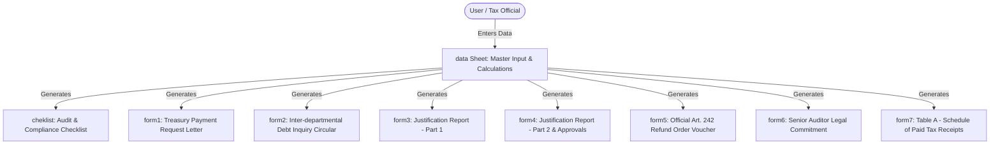
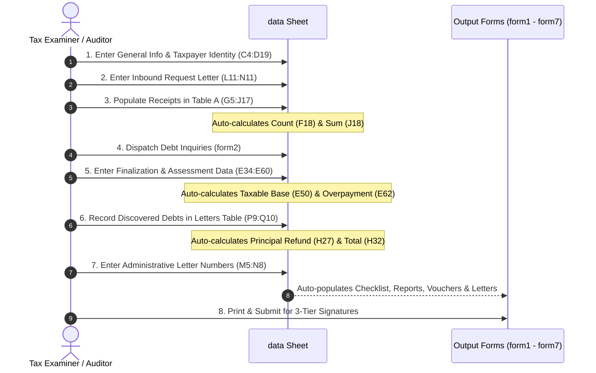
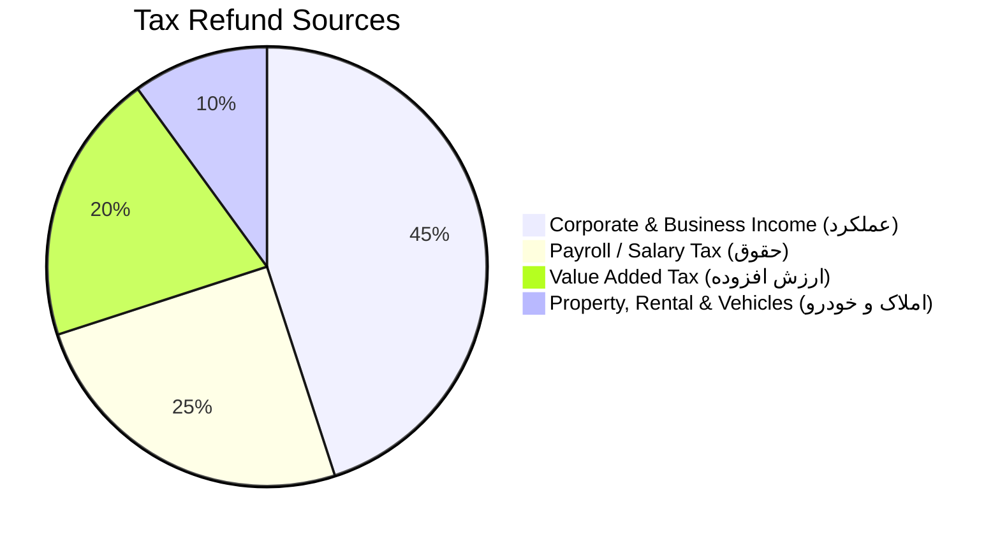
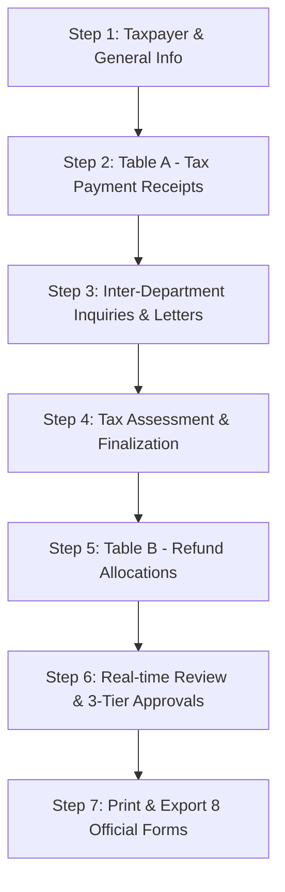
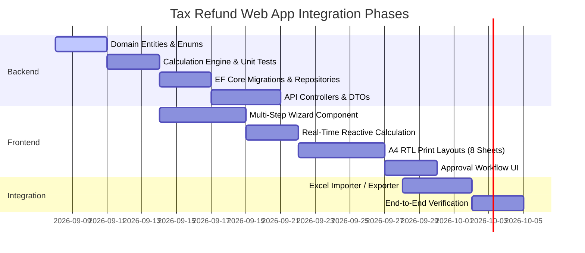

# Comprehensive Tax Refund Process & Web Application Integration Specification
## Analysis of `tax_refund_delfi خام.xlsm`, `tax_refund_delfi نمونه.xlsm`, and `سناریو استرداد.docx`

---

## 1. Executive Summary & Overview

### 1.1 Purpose and Legal Context
The tax refund process (استرداد مالیات اضافه دریافتی) in the Iranian State Tax Administration (سازمان امور مالیاتی کشور) is governed principally by:
- **Article 242 of the Direct Taxes Act (ماده ۲۴۲ قانون مالیات‌های مستقیم):** Dictates that any tax collected in excess of the final assessment or legitimate liability must be returned to the taxpayer out of current collections within one month from the date of determination/application.
- **Article 243 of the Direct Taxes Act (ماده ۲۴۳ و تبصره آن):** Entitles the taxpayer to late-payment compensation/damages (خسارت تاخیر در استرداد) at a rate of 1.5% per month if the tax administration delays refunding the surplus beyond the statutory deadline.

Currently, this procedure is handled manually or via ad-hoc Excel spreadsheets. The objective of the business scenario defined in `سناریو استرداد.docx` is to establish **procedural uniformity (وحدت رویه)**, standardize all related forms, enforce regulatory controls, enable comprehensive reporting on executed refunds, and eliminate manual errors and fraud risks.

---

### 1.2 The Analyzed Artifacts

1. [tax_refund_delfi خام.xlsm](file:///e:/projects/tax_summary_employee_app/payback_sample/tax_refund_delfi%20خام.xlsm):
   - A macro-enabled Excel workbook template consisting of 9 worksheets (`data`, `cheklist`, `form1`, `form2`, `form3`, `form4`, `form5`, `form6`, `form7`).
   - Contains empty input cells in `data`, formula wiring across output sheets, and embedded VBA macros for batch printing and clearing inputs.
2. [tax_refund_delfi نمونه.xlsm](file:///e:/projects/tax_summary_employee_app/payback_sample/tax_refund_delfi%20نمونه.xlsm):
   - A fully populated instance of the template representing a sample corporate income tax refund (`شرکت نمونه`, Economic Code `123456789`, Tax Year `1402`, Tax Unit `160300 Ahvaz`).
   - Comparison with the blank template reveals that **100% of data entry occurs exclusively in the `data` sheet**. All other 8 sheets are dynamic, formula-driven view/print templates.
3. [سناریو استرداد.docx](file:///e:/projects/tax_summary_employee_app/payback_sample/سناریو%20استرداد.docx):
   - The operational workflow scenario documenting the step-by-step sequence of tables, refund sources (Income, Payroll, VAT, Property, Rental, Vehicles), inquiry procedures, debt deductions, receipt allocations, and justification reporting.

---

## 2. Deep Dive: Workbook Architecture & Sheet Breakdown

The workbook is structured into **one centralized input/calculation engine (`data`)** and **eight specialized output/reporting sheets**.



### 2.1 The Master Sheet: `data`
The `data` worksheet contains four distinct data-entry zones and calculation sections:
1. **General & Taxpayer Identification (`C2:D19`):** Identity, jurisdiction, tax year, period, officials, bank details, and file number.
2. **Payment Receipts Schedule / Table A (`F2:J18`):** Up to 13 receipt rows (receipt number, issue date, collection date, amount) and totals.
3. **Official Letters & Debt Inquiries Schedule (`L2:Q15`):** Record of formal correspondence, including inbound taxpayer petition, internal debt inquiries, debt deductions, and reference numbers.
4. **Tax Assessment & Finalization Process (`C34:E62`):** Return filing data, final assessment notice, assessed income, taxable base, assessed tax, deductions for paid receipts, and net surplus calculation.
5. **Refund Breakdown & Summary (`C26:H32`):** Breakdown of principal tax refund (net of debts), stamp duty, penalties, delay damages, and grand total.

---

### 2.2 The Eight Output & Print Sheets

| Sheet Name | Title / Purpose (Persian) | Description & Role in Legal Process | Target Audience / Destination |
| :--- | :--- | :--- | :--- |
| **`cheklist`** | چک لیست کنترل اسناد استردادی | A 12-point audit checklist verifying taxpayer petition, bank certification, receipts authenticity, debt clearance, and approvals. | Internal Audit & Supervisory Inspection |
| **`form1`** | نامه به ذیحسابی جهت استرداد وجه | Formal disbursement letter to the Treasury Department (ذیحسابی) instructing payment of the refund amount to the taxpayer's Sheba account. | Treasury / Finance Department (ذیحسابی) |
| **`form2`** | استعلام از حوزه‌های مختلف | Inquiry circular sent to 5 specialized tax departments (Inheritance, Collection & Enforcement, Corporate & Payroll, Trades/Professions, VAT) to identify outstanding debts. | Internal Tax Departments (واحدهای مالیاتی) |
| **`form3`** | گزارش استرداد اضافه مالیات (بخش اول) | Formal justification report: Details legal grounds, taxpayer petition, return filing, assessment finalization, and calculation of gross surplus. | Senior Auditor & Supervisory Group |
| **`form4`** | ادامه گزارش استرداد (بخش دوم و تاییدات) | Second part of report: Lists results of debt inquiries, subtracts liabilities from surplus, establishes net payable, and provides 3 signature tiers. | Auditor, Group Head, Tax Administration Head |
| **`form5`** | برگ استرداد مالیات اضافه دریافتی (ماده ۲۴۲) | Official statutory refund voucher issued under Art. 242. Details refund breakdown, legal order to pay within 1 month, and lists receipts for cancellation. | Taxpayer File & Treasury |
| **`form6`** | فرم تعهد اداره امور مالیاتی | Solemn personal indemnity undertaking signed by the Senior Auditor guaranteeing receipts have not been previously refunded and assuming liability. | Treasury & Tax File |
| **`form7`** | جدول (الف) برگ استرداد موضوع ماده ۲۴۲ | Formal print schedule of all payment receipts submitted with the refund case, signed by the Group Head and Administration Head. | Attachment to Voucher (ضمیمه برگ استرداد) |

---

### 2.3 VBA Macros Inside the Workbook
Extracted from `xl/vbaProject.bin`:
1. **`Module1.chap_forms`**: Displays a confirmation prompt (`MsgBox`) and iterates through sheets `form1` to `form7`, issuing `ActiveWindow.SelectedSheets.PrintOut Copies:=1, Collate:=True`.
2. **`Module2.delete2`**: Displays a confirmation prompt and clears all user input cells:
   ```vb
   Range("D4:D5,D9:D11,D15:D23,g5:j17,m5:q15").ClearContents
   Range("h28:h31,e36:e48,e52:e54,e58,e34").ClearContents
   ```

---

### 2.4 Flaws, Bugs, and Limitations of the Excel Implementation

1. **Spreadsheet `#REF!` Bug in `form5!J28`:**
   - In `data`, row 27 is `اصل مالیات`, row 28 is `حق تمبر`, row 29 is `سایر`, row 30 is `جرایم`, and row 31 is `خسارت تاخیر`.
   - In `form5`, cell `J27` points to `=data!H30` (Penalties instead of Other), and `J28` has `=data!#REF!`. This was caused by an accidental cell deletion during Excel editing.
2. **Built-in Expiry Date Lock:**
   - Cell `AJ1` in `data` has `=DATE(2028,6,5)`. Every critical formula in `data` wraps its calculation with `=IF(TODAY()>=AJ1, "*فایل منقضی شد*", ...)`.
3. **Rigid Receipt Limit (Max 13 Receipts):**
   - The receipt grid in `data` (`F5:J17`) only accommodates 13 rows. If a company has 50 receipts during a tax year, the template fails without manual sheet restructuring.
4. **Omission of Table B in the Excel Model:**
   - While `سناریو استرداد.docx` clearly defines **Table B (جدول ب)** for listing only the receipts that are specifically refundable (whole or partial), the Excel sheet `form5` simply hardcoded the text string `"جدول الف"` in row 43.
5. **No Dynamic Debt Aggregation:**
   - Formula `data!H27` subtracts debt cell `P15` (`-E62-P15`), but in both raw and sample workbooks, `P15` is blank without a `SUM(P5:P14)` formula.
6. **No Validation or Audit Trail:**
   - No validation on Iranian National ID, Economic Code, or Sheba IBAN checksums.
   - Zero historical traceability or versioning.

---

## 3. Step-by-Step Process of Filling `tax_refund_delfi نمونه.xlsm`

To complete a tax refund case in `tax_refund_delfi نمونه.xlsm`, the user executes the following chronological steps strictly on the `data` sheet.



---

### Step 1: General Information & Taxpayer Identity (اطلاعات عمومی و هویتی)
The tax examiner enters the administrative and taxpayer metadata into `data!D4:D19`:

| Cell Coordinate | Persian Label | Business Meaning / Requirement | Sample Value (`نمونه`) | Validation & Format |
| :--- | :--- | :--- | :--- | :--- |
| **`D4`** | عنوان مودی | Taxpayer Legal or Trade Name | `شرکت نمونه` | Persian text |
| **`D5`** | شماره اقتصادی | 12-digit Economic Code (کد اقتصادی) | `123456789` | Numeric (10 to 12 digits) |
| **`D6`** | واحد مالیاتی | Tax Unit / Office Identifier Code | `160300` | Numeric identifier |
| **`D7`** | استان | Province of jurisdiction | `خوزستان` | Text |
| **`D8`** | شهرستان | County / City | `اهواز` | Text |
| **`D9`** | سال استرداد | Tax Year under examination | `1402` | 4-digit Jalali Year |
| **`D10`** | دوره | Tax Period (Quarter 1-4 for VAT/Seasonal) | `1` | Integer (1 to 4) |
| **`D11`** | منبع مالیاتی | Tax Source | `عملکرد` | Dropdown: `عملکرد`, `ارزش افزوده`, `حقوق` |
| **`D12`** | رئیس امور | Head of Tax Administration Name | `غلامرضا اسلامی` | Persian text |
| **`D13`** | رئیس گروه | Head of Audit Group Name | `مسعود بصیر` | Persian text |
| **`D14`** | کارشناس ارشد | Senior Tax Examiner / Auditor Name | `مهدی دلفی` | Persian text |
| **`D15`** | بانک مودی | Taxpayer's Bank Name | `ملی` | Persian text |
| **`D16`** | شماره شبا | Taxpayer's Sheba / IBAN Account | `ir12345665852353233` | 26 chars starting with `IR` |
| **`D17`** | نشانی مودی | Official Legal Address | `اهواز کیانپارس خ 17` | Persian text |
| **`D18`** | علت استرداد | Reason for Refund Request | `اشتباه واریزی` | Text (e.g., اشتباه واریزی, اضافه پرداختی) |
| **`D19`** | شماره پرونده | Tax Docket / File Number | `87` | Numeric / Text |

---

### Step 2: Inbound Taxpayer Petition (ثبت درخواست مودی)
The taxpayer submits an official refund application accompanied by payment receipts and bank verification.
- **`L11`**: Title: `درخواست استرداد مودی`
- **`M11`**: Letter Secretariat Registration Number (شماره وارده دبیرخانه): e.g., `526314`
- **`N11`**: Letter Date (تاریخ نامه): e.g., `1405/01/25`

---

### Step 3: Entering All Paid Tax Receipts (تکمیل جدول الف - اطلاعات قبوض)
In the receipts grid (`F5:J17`), the auditor enters all payment receipts made by the taxpayer for the specified tax year/period:
- **`F5:F17`**: Row index (ردیف ۱ تا ۱۳)
- **`G5:G17`**: Bank Receipt Number (شماره قبض), e.g., `987654321`, `654321987`
- **`H5:H17`**: Issue Date (تاریخ صدور قبض), e.g., `1403/05/01`
- **`I5:I17`**: Payment/Collection Date (تاریخ وصول بانک), e.g., `1403/05/01`
- **`J5:J17`**: Receipt Amount in Rials (مبلغ قبض به ریال), e.g., `300,000,000` and `15,000,000`

**Automatic Calculations in Table A:**
- **`F18` (Total Count):** `="تعداد کل قبوض: " & COUNT(G5:G17)` $\rightarrow$ Evaluates to `"تعداد کل قبوض: 2"`
- **`J18` (Total Amount Paid):** `=SUM(J5:J17)` $\rightarrow$ Evaluates to `315,000,000` Rials

---

### Step 4: Inter-Departmental Debt Inquiries (استعلام بدهی از سایر واحدها)
Before releasing state funds, the auditor issues **`form2`** (Internal Inquiry Circular) to other tax departments. Responses are recorded in the letters table (`L4:Q15`):
- **Collection & Enforcement (`وصول و اجرا`):**
  - Letter Number (`M9`): e.g., `1235465`
  - Letter Date (`N9`): e.g., `1405/02/01`
  - Debt Amount (`P9`): `0` (or liability amount if taxpayer owes money)
  - Debt Year (`Q9`): Tax year of liability if applicable
- **Withholding / Salary Tax Unit (`واحد مالیاتی تکلیفی`):**
  - Letter Number (`M10`): e.g., `6532487`
  - Letter Date (`N10`): e.g., `1405/02/01`
  - Debt Amount (`P10`): `0` (or liability amount)
- **Total Outstanding Debt (`P15`):** Sum of all discovered debts:
  $$\text{Total Debts } (P15) = \sum \text{Liabilities from Inquiries}$$

---

### Step 5: Tax Assessment & Finalization (فرآیند قطعی‌سازی پرونده)
The auditor enters the tax return and final assessment parameters into `C34:E62`:

| Coordinate | Parameter (Persian) | Description | Sample Formula / Value | Sample Evaluated |
| :--- | :--- | :--- | :--- | :--- |
| **`E34`** | مودی اظهارنامه تسلیم نموده؟ | Return filed? | `بله` | Dropdown: `بله` / `خیر` |
| **`E36`** | شماره اظهارنامه | Return Submission Tracking No. | `654321987` | Alphanumeric |
| **`E38`** | تاریخ تسلیم اظهارنامه | Return Submission Date | `1403/04/31` | Jalali Date |
| **`E40`** | نحوه قطعی شدن پرونده | Finalization Method | `علی الراس` | Dropdown (تایید اظهارنامه, رسیدگی به دفاتر, علی‌الراس, معافیت, زیان) |
| **`E42`** | شماره برگ قطعی | Final Assessment Notice No. | `326541789` | Alphanumeric |
| **`E44`** | تاریخ برگ قطعی | Final Assessment Notice Date | `1403/10/20` | Jalali Date |
| **`E46`** | درآمد تشخیصی قبل از کسر مالیات | Assessed Net Income (C) | `1,000,000,000` | Rials |
| **`E48`** | جمع معافیت‌ها و بخشودگی | Total Exemptions & Deductions (D) | `0` | Rials |
| **`E50`** | **مانده مشمول مالیات** | Taxable Income Base (E) | `=E46 - E48` | `1,000,000,000` |
| **`E52`** | مالیات تشخیصی | Assessed Tax Liability (F) | `250,000,000` | Rials (25% corporate tax) |
| **`E54`** | جرایم غیرقابل بخشش | Non-waivable Penalties (G) | `0` | Rials |
| **`E56`** | **جمع مالیات و جرایم** | Total Assessment (H) | `=E52 + E54` | `250,000,000` |
| **`E58`** | جایزه خوش‌حسابی | Timely Payment Bonus (I) | `0` | Rials |
| **`E60`** | **پرداختی به شرح جدول الف** | Total Paid per Table A (B) | `=J18` | `315,000,000` |
| **`E62`** | **مازاد پرداختی** | Surplus / Gross Overpayment (J) | `=E56 - E58 - E60` | **`-65,000,000`** |

> [!NOTE]
> A **negative** value in `E62` indicates an overpayment (مازاد پرداختی). In the sample:
> $$\text{Tax Liability } (250,000,000) - \text{Total Paid } (315,000,000) = -65,000,000 \text{ Rials}$$

---

### Step 6: Refund Breakdown & Net Calculation (شرح مبالغ قابل استرداد)
Located in `C26:H32`:
- **`H27` (اصل مالیات - Principal Tax Refund):**
  $$H27 = -E62 - P15 = -(-65,000,000) - 0 = +65,000,000 \text{ Rials}$$
  *(Gross overpayment minus outstanding debts discovered in inquiries).*
- **`H28` (حق تمبر - Stamp Duty):** `0` (or refundable stamp fees)
- **`H29` (سایر - Other):** `0`
- **`H30` (جرایم - Refundable Penalties):** `0`
- **`H31` (خسارت تاخیر - Art. 243 Delay Damages):** `0` (1.5% per month if applicable)
- **`H32` (جمع کل قابل استرداد - Grand Total Refundable):**
  $$H32 = \sum (H27:H31) = 65,000,000 \text{ Rials}$$

---

### Step 7: Administrative Letters & Document Identifiers
The auditor records the official outgoing protocol numbers for the refund file:
- **`M5` / `N5`**: برگ استرداد اصلی (Official Refund Order Voucher No. & Date): e.g., No. `526`, Date `1405/02/01`
- **`M6` / `N6`**: گزارش توجیه استرداد اداره (Justification Report No. & Date): e.g., No. `123456`, Date `1405/02/01`
- **`M7` / `N7`**: تعهد اداره مالیاتی (Auditor Commitment No. & Date): e.g., No. `123456`, Date `1405/02/01`
- **`M8` / `N8`**: نامه ذیحسابی (Treasury Disbursement Letter No. & Date): e.g., No. `4444412`, Date `1405/02/05`

---

### Step 8: Document Verification, Printing & 3-Tier Approvals
Once data entry is complete, the auditor verifies and prints the generated sheets:
1. **`form3` & `form4` (Justification Report):**
   - Tier 1: Prepared and signed by the **Senior Auditor (کارشناس ارشد)** (`D14`).
   - Tier 2: Reviewed and endorsed by the **Group Head (رئیس گروه)** (`D13`).
   - Tier 3: Formally approved and ordered by the **Tax Administration Head (رئیس امور)** (`D12`).
2. **`form5` (Official Voucher):**
   - Mandates payment within 1 month per Art. 242.
   - Signed and sealed by the Group Head and Administration Head.
3. **`form6` (Indemnity Undertaking):**
   - Signed by the Senior Auditor as personal guarantor.
4. **`form1` (Treasury Payment Letter):**
   - Sent to the Treasury Officer along with the taxpayer's certified Sheba number.

---

## 4. Nuances and Variations by Tax Source (منابع استرداد)

`سناریو استرداد.docx` identifies several distinct tax sources, each introducing specialized business logic:



1. **Corporate & Business Income Tax (مالیات بر درآمد شرکت‌ها و مشاغل):**
   - Standard flow as captured in `tax_refund_delfi نمونه.xlsm`.
   - Reconciles annual tax return with final assessment notice (برگ قطعی).
2. **Payroll / Salary Tax (مالیات بر حقوق):**
   - **Different Justification Narrative:** As noted in `سناریو استرداد.docx`: *"توجه: گزارش توجیهی حقوق تفاوت دارد"*.
   - **Personal Commitment Requirement:** *"در منبع حقوق تعهد شخص حقیقی نیاز است"*. Instead of an institutional indemnity or corporate seal, the individual employee/taxpayer must provide an explicit legal undertaking.
   - Requires reconciliation against monthly payroll tax declarations rather than an annual return.
3. **Value-Added Tax (مالیات بر ارزش افزوده):**
   - Operates on **quarterly periods (`دوره ۱ تا ۴`)** rather than annual cycles.
   - Separate accounting for **Tax (مالیات)** vs. **Municipal Levies (عوارض شهرداری)**.
   - Inquiries must verify VAT automated records and input tax credits.
4. **Property & Real Estate Transfer (نقل و انتقال املاک و اجاره):**
   - Tied to registry transaction numbers and cadastral records.

---

## 5. Web Application Integration Architecture

To eliminate the brittle Excel spreadsheet and integrate this entire procedure directly into `tax_summary_employee_app`, we adopt the existing **Clean Architecture** (.NET 8 Backend + Next.js 14 Frontend).

### 5.1 System Architecture Overview

```mermaid
graph LR
    subgraph Frontend["Frontend (Next.js 14 App Router)"]
        UI_Wizard[Multi-Step Wizard Form]
        UI_LiveCalc[Client-Side Real-time Calculator]
        UI_Approvals[Workflow & Approval Dashboard]
        UI_Print[A4 RTL Pixel-Perfect Print Views]
    end

    subgraph BackendAPI["Backend API (ASP.NET Core 8)"]
        Ctrl[TaxRefundsController]
        AuthGuard[JWT Auth & Role Guard]
    end

    subgraph AppCore["Application & Domain Layers"]
        CalcEngine[RefundCalculationEngine]
        Validators[FluentValidation with Persian Rules]
        WorkflowMgr[RefundWorkflowManager]
        Repo[(Repository & EF Core DbContext)]
    end

    Frontend -->|REST / JSON| BackendAPI
    BackendAPI --> AppCore
```



---

### 5.2 Domain Layer Models (`TaxSummary.Domain`)

Create new domain entities inside `Backend/TaxSummary.Domain/Entities/`:

#### 1. Entity: `TaxRefundCase` (Aggregate Root)
```csharp
public class TaxRefundCase : BaseAuditableEntity
{
    public long Id { get; set; }
    public string CaseTrackingNumber { get; set; } = string.Empty; // شماره پیگیری سامانه
    
    // Taxpayer Information
    public string TaxpayerName { get; set; } = string.Empty;
    public string EconomicCode { get; set; } = string.Empty;
    public string NationalId { get; set; } = string.Empty;
    public string TaxUnitCode { get; set; } = string.Empty;
    public string Province { get; set; } = string.Empty;
    public string City { get; set; } = string.Empty;
    public string Address { get; set; } = string.Empty;
    
    // Banking Details
    public string BankName { get; set; } = string.Empty;
    public string ShebaNumber { get; set; } = string.Empty; // Format: IR + 24 digits
    
    // Case Parameters
    public int TaxYear { get; set; } // e.g. 1402
    public int Period { get; set; } // 1..4
    public TaxSourceType TaxSource { get; set; } // عملکرد, ارزش افزوده, حقوق, ...
    public string RefundReason { get; set; } = string.Empty;
    public string DocketNumber { get; set; } = string.Empty; // شماره پرونده
    
    // Assigned Officials
    public string AdministrationHeadName { get; set; } = string.Empty;
    public string GroupHeadName { get; set; } = string.Empty;
    public string SeniorAuditorName { get; set; } = string.Empty;
    
    // Child Entities
    public TaxAssessmentInfo AssessmentInfo { get; set; } = new();
    public RefundBreakdown Breakdown { get; set; } = new();
    public List<TaxRefundReceipt> Receipts { get; set; } = new(); // Table A
    public List<RefundableReceiptAllocation> RefundAllocations { get; set; } = new(); // Table B
    public List<TaxRefundLetter> Letters { get; set; } = new();
    
    // Workflow Status
    public RefundCaseStatus Status { get; set; } = RefundCaseStatus.Draft;
    public List<RefundApprovalAction> Approvals { get; set; } = new();
}
```

#### 2. Supporting Value Objects & Enums
```csharp
public enum TaxSourceType
{
    CorporateIncome = 1, // عملکرد شرکت‌ها
    PersonalBusiness = 2, // عملکرد مشاغل
    SalaryPayroll = 3, // حقوق
    ValueAddedTax = 4, // ارزش افزوده
    PropertyRental = 5, // اجاره املاک
    PropertyTransfer = 6, // نقل و انتقال املاک
    Vehicles = 7 // خودرو
}

public enum FinalizationMethod
{
    ReturnAccepted = 1, // تایید اظهارنامه
    AuditBooks = 2, // رسیدگی به دفاتر
    AliRas = 3, // علی‌الراس
    TaxExemption = 4, // معافیت مالیاتی
    LossAccepted = 5 // قبول زیان
}

public enum RefundCaseStatus
{
    Draft = 0,
    InquiriesPending = 1,
    Audited = 2,
    GroupHeadApproved = 3,
    AdministrationHeadApproved = 4,
    TreasuryDisbursed = 5,
    Rejected = 6
}
```

#### 3. Related Entities: `TaxRefundReceipt` & `TaxRefundLetter`
```csharp
public class TaxRefundReceipt : BaseEntity
{
    public long TaxRefundCaseId { get; set; }
    public int RowIndex { get; set; }
    public string ReceiptNumber { get; set; } = string.Empty;
    public string IssueDateJalali { get; set; } = string.Empty; // 1403/05/01
    public string PaymentDateJalali { get; set; } = string.Empty;
    public decimal AmountRials { get; set; }
    public string? BankBranch { get; set; }
    public string? City { get; set; }
    public string? RevenueLedgerRow { get; set; }
}

public class RefundableReceiptAllocation : BaseEntity // جدول (ب)
{
    public long TaxRefundCaseId { get; set; }
    public long TaxRefundReceiptId { get; set; }
    public string ReceiptNumber { get; set; } = string.Empty;
    public decimal TotalReceiptAmount { get; set; }
    public decimal RefundableAmount { get; set; } // مبلغ قابل استرداد
    public string RevenueLedgerRow { get; set; } = string.Empty;
}

public class TaxRefundLetter : BaseEntity
{
    public long TaxRefundCaseId { get; set; }
    public string LetterType { get; set; } = string.Empty; // برگ استرداد, وصول و اجرا, ...
    public string LetterNumber { get; set; } = string.Empty;
    public string LetterDateJalali { get; set; } = string.Empty;
    public string Description { get; set; } = string.Empty;
    public decimal DebtAmount { get; set; } // مبلغ بدهی
    public string? DebtYear { get; set; } // سال بدهی
}
```

---

### 5.3 Application Layer: The Calculation Engine (`TaxSummary.Application`)

Implement a deterministic, zero-dependency domain service that replicates the tax formulas and fixes the spreadsheet bugs:

```csharp
public class RefundCalculationEngine
{
    public CalculationResult Compute(
        TaxAssessmentInfo assessment,
        IEnumerable<TaxRefundReceipt> receipts,
        IEnumerable<TaxRefundLetter> letters,
        RefundBreakdownManualInputs manualInputs)
    {
        var result = new CalculationResult();
        
        // 1. Receipts Total (Table A)
        result.TotalReceiptsCount = receipts.Count();
        result.TotalReceiptsAmount = receipts.Sum(r => r.AmountRials);
        
        // 2. Assessment Calculations
        result.TaxableBase = Math.Max(0, assessment.AssessedIncome - assessment.Exemptions);
        result.TotalAssessedTax = assessment.AssessedTax + assessment.NonWaivablePenalties;
        
        // 3. Overpayment / Surplus Paid (مازاد پرداختی)
        // Formula: TotalAssessed - TimelyBonus - TableAPaid
        // Negative indicates taxpayer overpaid
        result.SurplusPaid = result.TotalAssessedTax - assessment.TimelyPaymentBonus - result.TotalReceiptsAmount;
        
        // 4. Inquiries Debt Total (استعلامات)
        result.TotalDiscoveredDebts = letters.Sum(l => l.DebtAmount);
        
        // 5. Principal Refund (اصل مالیات قابل استرداد)
        // If SurplusPaid is negative (e.g. -65,000,000), gross surplus is +65,000,000
        decimal grossSurplus = result.SurplusPaid < 0 ? Math.Abs(result.SurplusPaid) : 0;
        result.PrincipalRefund = Math.Max(0, grossSurplus - result.TotalDiscoveredDebts);
        
        // 6. Additional Refund Items
        result.StampDutyRefund = manualInputs.StampDuty;
        result.OtherRefund = manualInputs.Other;
        result.PenaltiesRefund = manualInputs.Penalties;
        result.DelayDamages = manualInputs.DelayDamages; // Art. 243 Damages
        
        // 7. Grand Total
        result.GrandTotalRefundable = result.PrincipalRefund 
                                    + result.StampDutyRefund 
                                    + result.OtherRefund 
                                    + result.PenaltiesRefund 
                                    + result.DelayDamages;
        
        return result;
    }
}
```

---

### 5.4 Web Application User Interface Design (Next.js 14)

The web application replaces the Excel template with an interactive, guided **Multi-Step Wizard**:



#### Step 1: General & Taxpayer Identification
- Tax Source selector (`عملکرد`, `حقوق`, `ارزش افزوده`, etc.) with dynamic UI adjustments.
- Auto-complete for Taxpayer by Economic Code or National ID from historical database.
- IBAN/Sheba field with real-time Persian bank logo detection and checksum validation.
- Auto-fill for presiding officers based on the selected Tax Unit.

#### Step 2: Payment Receipts Grid (Table A)
- **Unlimited dynamic rows:** Add, remove, paste from Excel, or upload banking CSV.
- Live badge displaying: `تعداد قبوض: ۲` | `جمع پرداختی: ۳۱۵,۰۰۰,۰۰۰ ریال`.

#### Step 3: Official Correspondence & Inquiries
- Secretariat integration for tracking numbers and inbound petition dates.
- Interactive circular dispatch tracker for `ارث`, `وصول و اجرا`, `حقوق و تکلیفی`, `مشاغل`, `ارزش افزوده`.
- Direct recording of debt offsets.

#### Step 4: Finalization & Tax Determination
- Selection of finalization method (علی‌الراس, رسیدگی به دفاتر, etc.).
- Real-time reactive calculation card:
  $$\text{درآمد تشخیصی} - \text{معافیت‌ها} \implies \text{مانده مشمول}$$
  $$\text{مالیات تشخیصی} + \text{جرایم} \implies \text{جمع}$$
  $$\text{جمع} - \text{جایزه خوش‌حسابی} - \text{قبوض پرداختی} \implies \mathbf{مازاد\ پرداختی}$$

#### Step 5: Refundable Receipts Allocation (Table B)
- Directly addresses the flaw in the Excel template by allowing the examiner to select which receipts from Table A are being cancelled or partially refunded.

#### Step 6: Calculation Summary & Workflow Approvals
- Clear Persian breakdown displaying gross surplus, debt deductions, net refund, and delay interest.
- Multi-tier role-based approval buttons (Auditor Submit $\rightarrow$ Group Head Endorse $\rightarrow$ Tax Head Order).

---

### 5.5 Pixel-Perfect Printable Forms Engine

To replace the manual printing macro (`Module1.chap_forms`), the web app provides a dedicated **Print & Export Engine**:
- Built with Vanilla CSS / Tailwind `@media print` optimized for A4 Portrait.
- Exact typographical fidelity with Persian fonts (`Vazirmatn`, `IranNastaliq`, `B Titr`).
- Form layout templates matching:
  - **`form1` (نامه ذیحسابی):** Formatted official administrative letterhead.
  - **`form2` (استعلام حوزه‌ها):** Multi-department checklist letter.
  - **`form3` & `form4` (گزارش توجیهی):** 2-page formal justification report with 3 signature boxes.
  - **`form5` (برگ استرداد ماده ۲۴۲):** Bordered official tax voucher with breakdown table and receipt list.
  - **`form6` (فرم تعهد):** Legal guarantee certificate.
  - **`form7` (جدول الف):** Multi-page pagination support for large receipt batches.
  - **`cheklist` (چک‌لیست):** Compliance audit checklist.
- One-click **"چاپ کلیه فرم‌ها" (Print All Forms)** button generating a bundled, pre-collated PDF document.

---

### 5.6 Excel Import/Export Bridge (Backward Compatibility)
For smooth transition and audit compatibility:
1. **Excel Importer (`EPPlus` or `ClosedXML`):**
   - Allows users to upload legacy `.xlsm` files (like `tax_refund_delfi نمونه.xlsm`).
   - Parses the `data` sheet, maps cells to `TaxRefundCase`, and populates the database.
2. **Excel Exporter:**
   - Generates an identical `.xlsx` file from the database for offline archives or distribution.

---

## 6. Comparison: Excel Template vs. Integrated Web Application

| Feature / Requirement | Legacy Excel Template (`tax_refund_delfi`) | Proposed Web Application Integration |
| :--- | :--- | :--- |
| **Data Entry** | Manual entry into cell coordinates on `data` sheet | Guided multi-step wizard with smart validation & auto-complete |
| **Receipt Capacity** | Strictly hardcoded to 13 receipts | Unlimited dynamic receipt rows with Excel paste & CSV upload |
| **Table B Support** | Not implemented (hardcoded placeholder in `form5`) | First-class entity for individual receipt refund allocations |
| **Formula Errors** | `#REF!` bug in `form5!J28` and rigid cell dependencies | Unit-tested C# calculation engine with 100% mathematical integrity |
| **Time-Bomb Expiration**| Hardcoded lock on `2028/06/05` (`AJ1`) | Permanent, robust enterprise software lifecycle |
| **Debt Deduction Logic** | Cell `P15` lacked sum formula, risking miscalculation | Automated cross-inquiry debt aggregation and netting |
| **Multi-Source Support** | Generic layout; manual adjustments needed for Payroll/VAT | Tailored workflow modes for Corporate, Payroll, and VAT |
| **Role-Based Workflow** | None; physical paper routing required | Digital 3-tier approvals (Auditor $\rightarrow$ Group Head $\rightarrow$ Tax Head) |
| **Audit Trail & Security**| Any formula or cell can be overwritten without logs | Immutable event logging, field history, and role-based permissions |
| **Printing & Reports** | Brittle VBA macro requiring local Excel installation | Browser-native, pixel-perfect A4 RTL print & PDF generation |

---

## 7. Implementation Roadmap



### Phase 1: Domain & Persistence
- Add entities (`TaxRefundCase`, `TaxRefundReceipt`, `RefundableReceiptAllocation`, `TaxRefundLetter`, `RefundApprovalAction`) to `TaxSummary.Domain`.
- Configure EF Core Fluent API mappings, strategic indexes on Economic Code and Tracking Number, and execute EF Core migration.

### Phase 2: Business Logic & Application Layer
- Implement `RefundCalculationEngine` with thorough unit test coverage matching the sample numbers from `tax_refund_delfi نمونه.xlsm`.
- Implement FluentValidation validators for Iranian Sheba IBAN, Economic Code, and positive monetary values.
- Build Application Services / CQRS handlers for Create, Update, Submit, Approve, and Calculate.

### Phase 3: REST API Layer
- Implement `TaxRefundsController` with endpoints:
  - `POST /api/tax-refunds/calculate`: Real-time calculation sandbox.
  - `POST /api/tax-refunds`: Create refund docket.
  - `GET /api/tax-refunds/{id}`: Retrieve docket with all children.
  - `POST /api/tax-refunds/{id}/approvals`: Progress workflow status.
  - `GET /api/tax-refunds/{id}/reports/{formType}`: Structured data for specific printable sheets.
  - `POST /api/tax-refunds/import-excel`: Import legacy `.xlsm` files.

### Phase 4: Next.js Frontend Development
- Build the 6-step Iranian RTL refund wizard under `/refunds/new`.
- Implement live calculation feedback reflecting the exact formulas of the Direct Taxes Act.
- Implement the 8 print sheets (`cheklist`, `form1` to `form7`) matching the physical forms with pixel perfection.
- Build the supervisory approval dashboard under `/refunds/approvals`.
