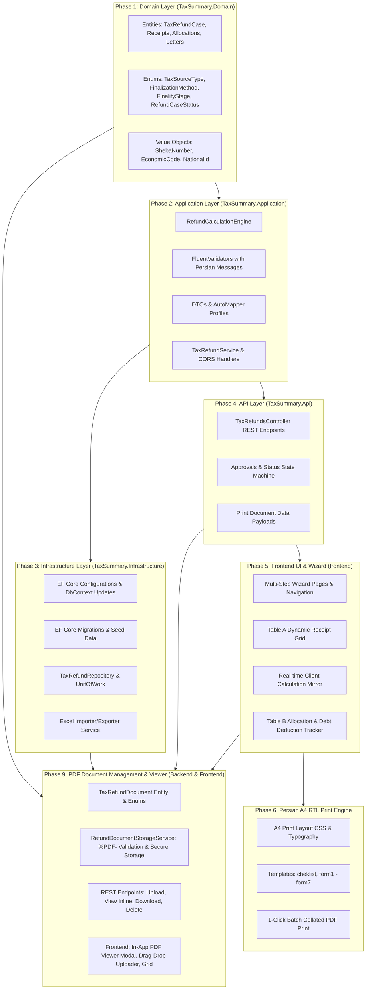
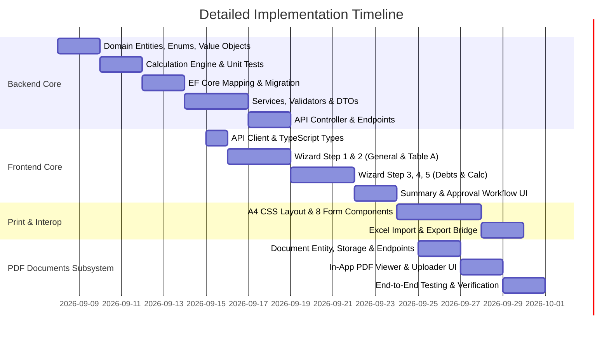

# Comprehensive Step-by-Step Implementation Plan: Tax Refund (Payback) System Integration
## Operational Roadmap for `tax_summary_employee_app`

Based on the legal, mathematical, and procedural specifications in [payback.md](file:///e:/projects/tax_summary_employee_app/payback.md), this roadmap outlines the end-to-end integration of the Tax Refund (استرداد مالیات اضافه دریافتی - موضوع مواد ۲۴۲ و ۲۴۳ ق.م.م) system into the existing Clean Architecture application (.NET 8 Backend + Next.js 14 Frontend).

---

## Architecture & Integration Matrix



---

## ⚠️ Mandatory Governance Rule: Implementation Plan Required Before Each Phase

> [!IMPORTANT]
> **Mandatory Implementation Plan Requirement:**
> Before implementing **each individual phase** of this roadmap (from Phase 1 through Phase 6 and beyond), a dedicated, comprehensive **Implementation Plan** must be drafted, reviewed, and approved first.
>
> **Execution Protocol for Each Phase:**
> 1. **Phase Implementation Plan Creation:** Create a detailed plan specifying exact target files to create or modify, class/method signatures, dependencies, edge cases, and automated verification commands.
> 2. **Review & Approval Gate:** Review and approve that phase's implementation plan before writing any production source code or running database migrations.
> 3. **Execution & Verification:** Execute the code modifications strictly following the approved phase plan, then run and document all verification checks.

---

## Phase 1: Domain Layer Modeling (`TaxSummary.Domain`)

### Goal
Define all business entities, value objects, domain rules, and workflow states without external dependencies, honoring the Persian tax terminology and legal requirements of Articles 242 & 243.

> [!NOTE]
> **Phase Prerequisite:** A dedicated Phase 1 Implementation Plan must be prepared and approved before initiating any domain layer development.

---

### Step 1.1: Enums & Value Objects
Create the core domain primitives in [TaxSummary.Domain](file:///e:/projects/tax_summary_employee_app/Backend/TaxSummary.Domain):
1. **[TaxSourceType.cs](file:///e:/projects/tax_summary_employee_app/Backend/TaxSummary.Domain/Entities/TaxRefundEnums.cs):**
   - `CorporateIncome` (عملکرد شرکت‌ها)
   - `PersonalBusiness` (عملکرد مشاغل)
   - `SalaryPayroll` (حقوق)
   - `ValueAddedTax` (ارزش افزوده)
   - `PropertyRental` (اجاره املاک)
   - `PropertyTransfer` (نقل و انتقال املاک)
   - `Vehicles` (خودرو)
2. **`FinalizationMethod` (نحوه رسیدگی / مبنای تشخیص):**
   - `ReturnAccepted` (تایید اظهارنامه)
   - `AuditBooks` (رسیدگی به دفاتر)
   - `AliRas` (علی‌الراس)
   - `TaxExemption` (معافیت مالیاتی)
   - `LossAccepted` (قبول زیان)
3. **`FinalityStage` (مرحله قطعیت پرونده مالیاتی):**
   - `Tamkin` (تمکین)
   - `TaxOfficeAgreement` (توافق در اداره امور مالیاتی)
   - `PrimaryBoardRuling` (رای هیات بدوی)
   - `AppellateBoardRuling` (رای هیات تجدید نظر)
   - `Article251` (251 - هیأت موضوع ماده ۲۵۱ مکرر)
   - `Article216` (216 - هیأت حل اختلاف ماده ۲۱۶)
4. **`RefundCaseStatus`:**
   - `Draft` (پیش‌نویس)
   - `InquiriesPending` (در انتظار پاسخ استعلامات)
   - `Audited` (گزارش توجیهی تنظیم شده)
   - `GroupHeadApproved` (تایید رئیس گروه)
   - `AdministrationHeadApproved` (دستور استرداد صادر شده - تایید رئیس امور)
   - `TreasuryDisbursed` (پرداخت شده توسط ذیحسابی)
   - `Rejected` (رد شده)
5. **Value Objects (`TaxSummary.Domain/ValueObjects/`):**
   - `ShebaNumber.cs`: Validates `IR` prefix + 24 digits + MOD-97 ISO 7064 checksum.
   - `EconomicCode.cs`: Validates 10-12 digit Iranian tax economic codes.
   - `JalaliDate.cs`: Validates `YYYY/MM/DD` Shamsi format and leap-year boundaries.

#### Verification Checks for Step 1.1
- [ ] **Unit Tests:** Run `dotnet test --filter "FullyQualifiedName~ValueObjects"`
- [ ] Verify `ShebaNumber.Create("ir12345665852353233")` passes checksum validation.
- [ ] Verify invalid Sheba strings throw domain validation exceptions with Persian messages.
- [ ] Verify zero third-party dependencies are referenced in `TaxSummary.Domain.csproj`.

---

### Step 1.2: Aggregate Root: `TaxRefundCase`
Create `TaxRefundCase.cs` in [TaxSummary.Domain/Entities](file:///e:/projects/tax_summary_employee_app/Backend/TaxSummary.Domain/Entities):
- Encapsulates:
  - Tracking Number (`CaseTrackingNumber`), Tax File/Docket Number (`DocketNumber`)
  - Taxpayer identity: Name, Economic Code, National ID, Tax Unit Code (`160300`), Province (`خوزستان`), City (`اهواز`), Address
  - Banking info: Bank Name (`ملی`), Sheba IBAN
  - Period parameters: Tax Year (`1402`), Period (`1`), Tax Source (`CorporateIncome`), Refund Reason (`اشتباه واریزی`)
  - Assigned Officers: Senior Auditor (`مهدی دلفی`), Group Head (`مسعود بصیر`), Tax Administration Head (`غلامرضا اسلامی`)
  - Status and Domain Events for status transitions.

#### Verification Checks for Step 1.2
- [ ] Entity compiles cleanly under `net8.0`.
- [ ] Constructor enforces non-empty required properties.
- [ ] Encapsulation rules verified: mutations occur through domain methods (e.g., `UpdateTaxpayerInfo()`, `TransitionToAudited()`).

---

### Step 1.3: Child Entities: Receipts (Table A & Table B), Letters, and Assessments
1. **`TaxRefundReceipt.cs` (جدول الف - قبوض پرداختی):**
   - Properties: `ReceiptNumber`, `IssueDateJalali`, `PaymentDateJalali`, `AmountRials`, `BankBranch`, `City`, `RevenueLedgerRow`.
2. **`RefundableReceiptAllocation.cs` (جدول ب - قبوض قابل استرداد):**
   - References `TaxRefundReceiptId`, `TotalReceiptAmount`, `RefundableAmount`, `RevenueLedgerRow`.
   - Domain rule: `RefundableAmount` must be $\le$ `TotalReceiptAmount`.
3. **`TaxRefundLetter.cs` (جدول نامه‌ها و استعلامات):**
   - Properties: `LetterType` (استعلام وصول و اجرا, استعلام حقوق, درخواست مودی, برگ استرداد, نامه ذیحسابی, تعهد اداره, گزارش توجیهی), `LetterNumber`, `LetterDateJalali`, `Description`, `DebtAmount`, `DebtYear`.
4. **`TaxAssessmentInfo.cs` (فرآیند قطعی‌سازی پرونده):**
   - Properties: `HasReturnFiled` (bool), `ReturnNumber`, `ReturnDateJalali`, `FinalizationMethod` (نحوه قطعی شدن), `FinalityStage` (مرحله قطعیت: تمکین، توافق در اداره امور مالیاتی، رای هیات بدوی، رای هیات تجدید نظر، 251، 216), `FinalNoticeNumber`, `FinalNoticeDateJalali`, `AssessedIncome`, `Exemptions`, `AssessedTax`, `NonWaivablePenalties`, `TimelyPaymentBonus`.
5. **`RefundBreakdown.cs` (شرح مبالغ قابل استرداد):**
   - Properties: `PrincipalTaxRefund`, `StampDutyRefund`, `OtherRefund`, `PenaltiesRefund`, `DelayDamages`, `GrandTotalRefundable`.

#### Verification Checks for Step 1.3
- [ ] Unit test: Ensure `RefundableReceiptAllocation` rejects negative amounts or amounts exceeding the parent receipt.
- [ ] Unit test: Ensure `TaxRefundCase.AddReceipt()` correctly attaches child receipts and updates aggregate root modification timestamp.

---

## Phase 2: Mathematical Engine & Application Layer (`TaxSummary.Application`)

### Goal
Implement the calculation engine, DTOs, mappings, commands/queries, and FluentValidation rules matching the exact formula logic of `tax_refund_delfi نمونه.xlsm` without its spreadsheet errors.

> [!NOTE]
> **Phase Prerequisite:** A dedicated Phase 2 Implementation Plan must be prepared and approved before initiating application layer development.

---

### Step 2.1: `RefundCalculationEngine` Implementation
Create `RefundCalculationEngine.cs` in [TaxSummary.Application/Services](file:///e:/projects/tax_summary_employee_app/Backend/TaxSummary.Application/Services):
- **Formula 1: Table A Aggregation**
  $$\text{TotalReceiptsCount} = N(\text{Receipts}), \quad \text{TotalPaidAmount} = \sum \text{AmountRials}$$
- **Formula 2: Taxable Base**
  $$\text{TaxableBase} = \max(0, \text{AssessedIncome} - \text{Exemptions})$$
- **Formula 3: Total Tax Liability**
  $$\text{TotalAssessed} = \text{AssessedTax} + \text{NonWaivablePenalties}$$
- **Formula 4: Surplus Paid (مازاد پرداختی)**
  $$\text{SurplusPaid} = \text{TotalAssessed} - \text{TimelyPaymentBonus} - \text{TotalPaidAmount}$$
  *(A negative value indicates overpayment: e.g. $250,000,000 - 315,000,000 = -65,000,000$ Rials)*
- **Formula 5: Total Discovered Debts**
  $$\text{TotalDebts} = \sum \text{Letters.DebtAmount}$$
- **Formula 6: Net Principal Refund (اصل مالیات قابل استرداد)**
  $$\text{GrossSurplus} = \begin{cases} |\text{SurplusPaid}| & \text{if } \text{SurplusPaid} < 0 \\ 0 & \text{otherwise} \end{cases}$$
  $$\text{PrincipalRefund} = \max(0, \text{GrossSurplus} - \text{TotalDebts})$$
- **Formula 7: Grand Total Refundable**
  $$\text{GrandTotal} = \text{PrincipalRefund} + \text{StampDuty} + \text{Other} + \text{Penalties} + \text{DelayDamages}$$

#### Verification Checks for Step 2.1
- [ ] **Exact Sample Benchmark Test:** Write xUnit test `CalculateRefund_GivenSampleData_MatchesExcelOutputs`:
  - Inputs: Receipts = `[300,000,000, 15,000,000]`, AssessedIncome = `1,000,000,000`, AssessedTax = `250,000,000`, Debts = `0`.
  - Assertions:
    - `TotalPaidAmount` must equal `315,000,000`.
    - `TaxableBase` must equal `1,000,000,000`.
    - `SurplusPaid` must equal `-65,000,000`.
    - `PrincipalRefund` must equal `65,000,000`.
    - `GrandTotalRefundable` must equal `65,000,000`.
- [ ] **Debt Deduction Test:** Add debt of `10,000,000` Rials in Collection & Enforcement; verify `PrincipalRefund` correctly reduces to `55,000,000` Rials.
- [ ] **Zero Overpayment Test:** When tax liability $\ge$ paid receipts, verify `SurplusPaid` $\ge 0$ and `PrincipalRefund` $= 0$.

---

### Step 2.2: DTOs & AutoMapper Configuration
Create DTOs in `TaxSummary.Application/DTOs/TaxRefund/`:
- `TaxRefundCaseDto`, `CreateTaxRefundCaseDto`, `UpdateTaxRefundCaseDto`
- `TaxRefundReceiptDto`, `CreateTaxRefundReceiptDto`
- `RefundableReceiptAllocationDto`
- `TaxRefundLetterDto`
- `TaxAssessmentInfoDto`
- `RefundCalculationResultDto`
- `PrintableFormDto` (unified view model for all 8 print sheets)
- Create AutoMapper Profile `TaxRefundMappingProfile.cs`.

#### Verification Checks for Step 2.2
- [ ] AutoMapper configuration test: `mapper.ConfigurationProvider.AssertConfigurationIsValid()` passes without unmapped properties.

---

### Step 2.3: FluentValidation with Persian Localization
Create validators in `TaxSummary.Application/Validators/TaxRefund/`:
- `CreateTaxRefundCaseValidator`: Validates non-empty Taxpayer Name, valid Sheba format, valid Economic Code, valid Shamsi year (e.g. $1390 \le \text{Year} \le 1410$).
- `CreateTaxRefundReceiptValidator`: Validates positive Rial amounts, valid Jalali date formats.
- `TaxAssessmentInfoValidator`: Validates non-negative amounts for income, exemptions, and taxes.

#### Verification Checks for Step 2.3
- [ ] Unit tests verifying that Persian validation errors are returned when Sheba is invalid or amounts are negative.

---

### Step 2.4: Application Service & Orchestration
Create `ITaxRefundService` and `TaxRefundService` in [TaxSummary.Application/Services](file:///e:/projects/tax_summary_employee_app/Backend/TaxSummary.Application/Services):
- Methods:
  - `GetByIdAsync(long id)`
  - `GetPagedAsync(TaxRefundFilterDto filter)`
  - `CreateAsync(CreateTaxRefundCaseDto dto)`
  - `UpdateAsync(long id, UpdateTaxRefundCaseDto dto)`
  - `CalculateSandboxAsync(CalculateRefundRequestDto dto)`
  - `SubmitApprovalAsync(long id, SubmitApprovalDto dto)`
  - `GetPrintableFormDataAsync(long id, string formType)`

#### Verification Checks for Step 2.4
- [ ] Mock repository tests for `TaxRefundService` verifying state transitions and calculation consistency.

---

## Phase 3: Infrastructure Layer & Database Persistence (`TaxSummary.Infrastructure`)

### Goal
Configure EF Core persistence with strategic indexes, cascade delete rules, audit logs, seed data, and migration scripts.

> [!NOTE]
> **Phase Prerequisite:** A dedicated Phase 3 Implementation Plan must be prepared and approved before modifying entity configurations, running EF migrations, or updating seed initializers.

---

### Step 3.1: Entity Configurations (Fluent API)
Create configuration files in [TaxSummary.Infrastructure/Data/Configurations](file:///e:/projects/tax_summary_employee_app/Backend/TaxSummary.Infrastructure/Data/Configurations):
- `TaxRefundCaseConfiguration.cs`:
  - Table name: `TaxRefundCases`
  - Max length constraints (e.g., `TaxpayerName` 200, `ShebaNumber` 30, `EconomicCode` 20)
  - Indexes: Unique index on `CaseTrackingNumber`, composite index on `(TaxpayerName, TaxYear)`, index on `EconomicCode`, index on `Status`
  - Complex properties: OwnsOne `AssessmentInfo`, OwnsOne `Breakdown`
  - Relationships: HasMany `Receipts` (cascade delete), HasMany `Letters` (cascade delete), HasMany `RefundAllocations` (cascade delete)
- `TaxRefundReceiptConfiguration.cs`, `TaxRefundLetterConfiguration.cs`, `RefundableReceiptAllocationConfiguration.cs`.

#### Verification Checks for Step 3.1
- [ ] Review all relationship configurations to ensure cascade deletes and required foreign keys are explicitly mapped.

---

### Step 3.2: DbContext Integration & Repositories
Update [TaxSummaryDbContext.cs](file:///e:/projects/tax_summary_employee_app/Backend/TaxSummary.Infrastructure/Data/TaxSummaryDbContext.cs):
```csharp
public DbSet<TaxRefundCase> TaxRefundCases => Set<TaxRefundCase>();
public DbSet<TaxRefundReceipt> TaxRefundReceipts => Set<TaxRefundReceipt>();
public DbSet<TaxRefundLetter> TaxRefundLetters => Set<TaxRefundLetter>();
public DbSet<RefundableReceiptAllocation> RefundableReceiptAllocations => Set<RefundableReceiptAllocation>();
```
- Implement `ITaxRefundRepository` and `TaxRefundRepository` in `TaxSummary.Infrastructure/Repositories/`.

#### Verification Checks for Step 3.2
- [ ] Verify `TaxSummaryDbContext` builds cleanly and registers all 4 new DbSets.

---

### Step 3.3: EF Core Migrations
Generate and apply the EF Core migration:
```powershell
dotnet ef migrations add AddTaxRefundSystem --project Backend/TaxSummary.Infrastructure --startup-project Backend/TaxSummary.Api
```

#### Verification Checks for Step 3.3
- [ ] Migration generated without warnings or circular cascades.
- [ ] Run `dotnet ef database update --project Backend/TaxSummary.Infrastructure --startup-project Backend/TaxSummary.Api`.
- [ ] Inspect database schema via sqlite3 or db tool; confirm tables and indexes exist.

---

### Step 3.4: Seed Data Initializer
Update [DbInitializer.cs](file:///e:/projects/tax_summary_employee_app/Backend/TaxSummary.Infrastructure/Data/DbInitializer.cs):
- Seed the exact sample case from `tax_refund_delfi نمونه.xlsm`:
  - Taxpayer: `شرکت نمونه`, Economic Code: `123456789`, Tax Unit: `160300`, Province: `خوزستان`, City: `اهواز`, Year: `1402`.
  - 2 receipts: `987654321` (300,000,000 Rials) and `654321987` (15,000,000 Rials).
  - Letters: Inbound petition `526314`, Collection & Enforcement `1235465`, Withholding `6532487`.
  - Finalization: Ali-al-Ras, Assessed Income `1,000,000,000`, Assessed Tax `250,000,000`.
  - Computed Refund: `65,000,000` Rials.

#### Verification Checks for Step 3.4
- [ ] Start API, allow DbInitializer to run, and verify database contains the seeded case with all child receipts and letters.

---

## Phase 4: API Layer & Workflow Endpoints (`TaxSummary.Api`)

### Goal
Expose RESTful endpoints for CRUD, interactive calculation sandbox, workflow state transitions (Auditor $\rightarrow$ Group Head $\rightarrow$ Administration Head), and printable view-model queries.

> [!NOTE]
> **Phase Prerequisite:** A dedicated Phase 4 Implementation Plan must be prepared and approved before implementing controller endpoints or modifying API middleware.

---

### Step 4.1: `TaxRefundsController` Implementation
Create `TaxRefundsController.cs` in [TaxSummary.Api/Controllers](file:///e:/projects/tax_summary_employee_app/Backend/TaxSummary.Api/Controllers):
- `POST /api/tax-refunds/calculate`: Real-time sandbox computing taxes, overpayment, and refund from request payload without persisting.
- `GET /api/tax-refunds`: Paginated list of refund cases with filters (tax year, status, economic code, search).
- `GET /api/tax-refunds/{id}`: Detailed view including receipts, letters, allocations, and current calculation.
- `POST /api/tax-refunds`: Create new refund case (Status: `Draft`).
- `PUT /api/tax-refunds/{id}`: Update case details (only allowed in `Draft` or `InquiriesPending` status).
- `DELETE /api/tax-refunds/{id}`: Soft delete or remove draft.
- `POST /api/tax-refunds/{id}/approvals`: Submit review or approval action.
- `GET /api/tax-refunds/{id}/print/{formType}`: Returns formatted JSON view-model tailored for any of the 8 forms (`cheklist`, `form1` to `form7`).

#### Verification Checks for Step 4.1
- [ ] Test endpoints using Swagger UI at `http://localhost:5000/swagger`.
- [ ] Send `POST /api/tax-refunds/calculate` with sample JSON; verify returned JSON has `principalRefund: 65000000` and `surplusPaid: -65000000`.
- [ ] Test status transitions: verify an unauthorized user or invalid transition returns HTTP 400 with a Persian error message.

---

### Step 4.2: Excel Import/Export Endpoints
Add import and export capabilities:
- `POST /api/tax-refunds/import-excel`: Accepts an uploaded `.xlsm` file (like `tax_refund_delfi نمونه.xlsm`), parses cell coordinates from sheet `data`, and converts it into a `TaxRefundCase` in the database.
- `GET /api/tax-refunds/{id}/export-excel`: Generates an official `.xlsx` workbook with all 9 sheets pre-filled and formulas wired.

#### Verification Checks for Step 4.2
- [ ] Upload `payback_sample/tax_refund_delfi نمونه.xlsm` to `/api/tax-refunds/import-excel`.
- [ ] Confirm the newly created database record matches all fields of `شرکت نمونه`.
- [ ] Download exported Excel via `/export-excel` and confirm it opens cleanly without repair errors.

---

## Phase 5: Frontend Multi-Step Wizard & Live Calculation (`frontend`)

### Goal
Build an intuitive, responsive, RTL Persian web UI replacing the manual Excel spreadsheet with a step-by-step guided wizard.

> [!NOTE]
> **Phase Prerequisite:** A dedicated Phase 5 Implementation Plan must be prepared and approved before building frontend wizard pages, state hooks, and client calculation components.

---

### Step 5.1: Types & API Client Services
In [frontend](file:///e:/projects/tax_summary_employee_app/frontend):
- Create `types/taxRefund.ts`: TypeScript interfaces for `TaxRefundCase`, `TaxRefundReceipt`, `TaxRefundLetter`, `CalculationResult`, and form state.
- Create `lib/taxRefundApi.ts`: Axios client functions connecting to `/api/tax-refunds/*`.

#### Verification Checks for Step 5.1
- [ ] TypeScript compiles cleanly with zero type errors (`npm run build` or `npx tsc --noEmit`).

---

### Step 5.2: Multi-Step Wizard Component Architecture
Create wizard directory: `frontend/app/refunds/new/` or `components/refunds/wizard/`:
- **Step Navigation Bar:** Visual breadcrumb showing 6 steps with completion indicators:
  1. `اطلاعات عمومی و مودی` (Taxpayer & General Info)
  2. `قبوض پرداختی (جدول الف)` (Paid Tax Receipts)
  3. `استعلامات و نامه‌ها` (Inquiries & Debt Clearance)
  4. `قطعی‌سازی پرونده` (Tax Assessment & Deductions)
  5. `تخصیص قبوض استردادی (جدول ب)` (Table B Allocations)
  6. `خلاصه محاسبات و ثبت نهایی` (Summary & Finalization)

#### Verification Checks for Step 5.2
- [ ] Wizard renders with active step highlighting and prevents jumping ahead until current step validation passes.

---

### Step 5.3: Step 1 - General Info & Taxpayer Identification
Form inputs matching `data!C4:D19`:
- Tax Source dropdown: `عملکرد`, `حقوق`, `ارزش افزوده`, `اجاره`, `نقل و انتقال املاک`.
- Taxpayer Name, Economic Code (with 10-12 digit regex validation), National ID.
- Tax Unit Code (`160300`), Province (`خوزستان`), City (`اهواز`).
- Bank Name and Sheba IBAN input with real-time Persian bank logo display and checksum validation.
- Assigned Officials: Senior Auditor, Group Head, Tax Administration Head.

#### Verification Checks for Step 5.3
- [ ] Form displays error message if Sheba checksum fails or Economic Code format is wrong.

---

### Step 5.4: Step 2 - Dynamic Table A Grid (قبوض پرداختی)
Interactive data table matching `data!F4:J18`:
- Add / Remove row buttons.
- Paste from Excel clipboard support (tab-separated values auto-populates rows).
- Live counter banner: **تعداد کل قبوض** and **جمع مبالغ پرداختی (ریال)** formatted with Persian thousand separators.

#### Verification Checks for Step 5.4
- [ ] Adding receipts dynamically updates the sum banner immediately.
- [ ] Pasting 5 rows from Excel clipboard correctly parses numbers and Jalali dates.

---

### Step 5.5: Step 3 - Inter-Departmental Debt Inquiries
Interactive circulars panel:
- Inbound Taxpayer Petition (Letter No. & Date).
- Circular status cards for:
  - `وصول و اجرا` (Collection & Enforcement): Debt amount input.
  - `واحد تکلیفی و حقوق` (Withholding & Payroll): Debt amount input.
  - `ارث`, `مشاغل`, `ارزش افزوده`: Inquiries status and debt inputs.
- Aggregated debt summary card showing total deductions.

#### Verification Checks for Step 5.5
- [ ] Entering debt amounts in Collection & Enforcement dynamically reflects in the debt summary.

---

### Step 5.6: Step 4 & 5 - Tax Assessment & Live Reactive Calculation Mirror
- Inputs for Return Filing (Yes/No, Number, Date), Finalization Method (Ali-al-Ras, Books, etc.), Final Notice No./Date.
- **مرحله قطعیت (Assessment Finality Stage):** Dropdown with 6 legal stages:
  1. `تمکین` (Tamkin)
  2. `توافق در اداره امور مالیاتی` (Tax Office Agreement - Art. 238)
  3. `رای هیات بدوی` (Primary Board Ruling)
  4. `رای هیات تجدید نظر` (Appellate Board Ruling)
  5. `251` (Article 251 bis)
  6. `216` (Article 216)
- Financial entries: Assessed Income, Exemptions, Assessed Tax, Non-waivable Penalties, Timely Bonus.
- **Client-Side Reactive Calculation Card (Sticky sidebar or bottom summary):**
  - Displays live calculation of:
    - مانده مشمول (Taxable Base)
    - جمع مالیات و جرایم (Total Assessed)
    - مازاد پرداختی (Surplus Paid)
    - خالص اصل مالیات قابل استرداد (Net Refund after Debt Deduction)
  - Synchronizes with backend `/api/tax-refunds/calculate` with debounced requests.
- **Table B Allocation (جدول ب):**
  - Checkbox list of Table A receipts where examiner can specify the exact amount of each receipt allocated for refund/cancellation.

#### Verification Checks for Step 5.6
- [ ] Live numbers match sample: entering Income `1B`, Tax `250M`, Receipts `315M` instantly displays Overpayment `-65,000,000` and Refundable `+65,000,000`.

---

## Phase 6: Persian A4 RTL Print & Document Engine

### Goal
Implement pixel-perfect, print-ready CSS templates matching the physical layouts of all 8 forms (`cheklist`, `form1` to `form7`).

> [!NOTE]
> **Phase Prerequisite:** A dedicated Phase 6 Implementation Plan must be prepared and approved before implementing print templates, CSS layouts, and batch export handlers.

---

### Step 6.1: Print Layout Infrastructure
- Add dedicated print layout wrapper with `@media print` rules:
  - A4 dimensions: `210mm x 297mm`, `margin: 10mm 12mm`.
  - Iranian fonts: `Vazirmatn`, `B Titr`, `IranNastaliq`.
  - Page-break controls (`break-inside-avoid`, `page-break-after: always`).
  - Watermark and header support (جمهوری اسلامی ایران - وزارت امور اقتصادی و دارایی - سازمان امور مالیاتی کشور).

#### Verification Checks for Step 6.1
- [ ] Browser print preview (`Ctrl+P`) renders crisp borders, no overlapping text, and fits exactly on 1 page per document.

---

### Step 6.2: Implementing the 8 Individual Form Templates
Create specialized print views in `frontend/components/refunds/print/`:
1. **`ChecklistPrint.tsx` (`cheklist`):**
   - 12 audit check items with signature boxes for Group Head and Administration Head.
2. **`TreasuryLetterPrint.tsx` (`form1`):**
   - Formal disbursement letter to ذیحسابی detailing taxpayer name, economic code, file number, refund amount in numbers and words, Sheba IBAN, and bank name.
3. **`InquiryCircularPrint.tsx` (`form2`):**
   - Internal circular addressed to 5 tax departments requesting debt clearance.
4. **`JustificationReportPart1Print.tsx` (`form3`):**
   - Taxpayer petition reference, tax return status, assessment calculation summary table.
5. **`JustificationReportPart2Print.tsx` (`form4`):**
   - Debt deduction results (الف، ب، ج), net payable confirmation, and 3-tier signature blocks (Senior Auditor, Group Head, Administration Head).
6. **`StatutoryRefundVoucherPrint.tsx` (`form5`):**
   - Official voucher under Art. 242. Contains refund breakdown (اصل مالیات, حق تمبر, سایر, جرایم, خسارت تاخیر), one-month payment mandate, and receipts schedule.
   - **Bug Fix:** Resolves the Excel `#REF!` bug; properly maps and displays all breakdown lines.
7. **`AuditorCommitmentPrint.tsx` (`form6`):**
   - Formal personal indemnity statement signed by the Senior Auditor.
8. **`TableAPrint.tsx` (`form7`):**
   - Official schedule of paid receipts with columns: ردیف, شماره قبض, تاریخ صدور, نام شعبه, شهرستان, مبلغ, شماره درآمد.

#### Verification Checks for Step 6.2
- [ ] Visual verification of each of the 8 forms against the corresponding sheets in `tax_refund_delfi نمونه.xlsm`.
- [ ] Ensure all dynamic values (names, amounts, dates, letter numbers) populate correctly without empty placeholders.

---

### Step 6.3: Batch Print & PDF Generation
- Add a master **"چاپ بسته کامل مدارک استرداد" (Print Complete Refund Package)** button that renders all 8 forms in legal collated order with proper page breaks.

#### Verification Checks for Step 6.3
- [ ] Triggering batch print opens browser print dialog with all 8 forms correctly separated across sequential A4 pages.

---

## Phase 9: PDF Document Management & Secure In-App Viewer Engine

### Goal
Provide an enterprise-grade, secure PDF document management subsystem for tax refund cases. Enables tax officials and examiners to upload, categorize, validate, securely stream, preview in-browser, download, and delete supporting documents (taxpayer petitions, bank payment slips/receipts, assessment and final notices, inter-departmental debt clearances, justification reports, treasury disbursement receipts).

> [!NOTE]
> **Phase Prerequisite:** A dedicated Phase 9 Implementation Plan must be prepared and approved before implementing document domain entities, storage services, API endpoints, or frontend viewer components.

---

### Step 9.1: Domain Layer Modeling (`TaxSummary.Domain`)
Create core document domain models:
1. **`TaxRefundDocumentType.cs` (نوع سند پیوست):**
   - `TaxpayerPetition = 1` (درخواست مودی / برگ تقاضای استرداد)
   - `ReceiptProof = 2` (تصویر فیش یا قبض پرداخت بانکی)
   - `AssessmentNotice = 3` (برگ تشخیص / برگ قطعی مالیات)
   - `InquiryResponse = 4` (پاسخ استعلام وصول و اجرا یا عدم بدهی)
   - `JustificationReport = 5` (گزارش توجیهی حسابرسی و تاییدات)
   - `OfficeCommitment = 6` (فرم تعهد رسمی کارشناس ارشد)
   - `DisbursementReceipt = 7` (رسید پرداخت و حواله ذیحسابی)
   - `IdentityProof = 8` (مدارک شناسایی، وکالت‌نامه یا روزنامه رسمی)
   - `Other = 9` (سایر مدارک و ضمائم پرونده)

2. **`TaxRefundDocument.cs` (موجودیت سند پرونده استرداد):**
   - Properties:
     - `Id` (Guid)
     - `TaxRefundCaseId` (Guid)
     - `DocumentType` (TaxRefundDocumentType)
     - `Title` (string - عنوان مشخص سند)
     - `OriginalFileName` (string - نام فایل بارگذاری شده)
     - `StoredFileName` (string - نام یکتا ذخیره شده در دیسک)
     - `FilePath` (string - مسیر فایل امن)
     - `FileSize` (long - حجم به بایت)
     - `ContentType` (string - "application/pdf")
     - `UploadDateJalali` (string - تاریخ بارگذاری شمسی)
     - `UploadedByUserId` (Guid)
     - `UploadedByUserName` (string)
     - `Description` (string? - توضیحات اختیاری)
     - `RelatedReceiptId` (Guid? - ارتباط اختیاری با قبض مشخص در جدول الف)
     - `RelatedLetterId` (Guid? - ارتباط اختیاری با استعلام مشخص در جدول استعلامات)
     - `CreatedAt` (DateTime)
   - Methods: `Create(...)`, `UpdateDetails(...)`

3. **`TaxRefundCase.cs` Aggregate Root Updates:**
   - Collection: `public ICollection<TaxRefundDocument> Documents { get; private set; } = new List<TaxRefundDocument>();`
   - Domain methods:
     - `TaxRefundDocument AddDocument(...)`
     - `void RemoveDocument(Guid documentId)`

#### Verification Checks for Step 9.1
- [ ] Unit tests in `TaxSummary.Domain.Tests`:
  - `TaxRefundDocument.Create` rejects empty titles, invalid CaseId, or negative file sizes.
  - `TaxRefundCase.AddDocument` attaches document and updates aggregate timestamp.
  - `TaxRefundCase.RemoveDocument` removes specified document from collection.

---

### Step 9.2: Application Layer & Storage Abstraction (`TaxSummary.Application`)
1. **DTOs (`TaxSummary.Application/DTOs/TaxRefund/`):**
   - `TaxRefundDocumentDto`: View model including `DocumentTypeDescription`, formatted file size (`1.8 MB`), `DownloadUrl`, and `ViewUrl`.
   - `UploadTaxRefundDocumentDto`: Input model containing `Title`, `DocumentType`, `Description`, `RelatedReceiptId`, `RelatedLetterId`.
2. **FluentValidation (`TaxSummary.Application/Validators/TaxRefund/`):**
   - `UploadTaxRefundDocumentValidator`: Validates non-empty title (max 200 chars), valid DocumentType enum range, and optional description length.
3. **AutoMapper Configuration (`TaxRefundMappingProfile.cs`):**
   - Maps `TaxRefundDocument` to `TaxRefundDocumentDto` with Persian label resolvers and size formatting.
4. **Storage Service Interface (`IRefundDocumentStorageService.cs`):**
   ```csharp
   public interface IRefundDocumentStorageService
   {
       Task<(string StoredFileName, string RelativePath, long FileSize)> SavePdfAsync(IFormFile file, Guid caseId, CancellationToken ct = default);
       Task<(Stream Stream, string ContentType, string FileName)> GetPdfStreamAsync(string relativePath, string originalFileName, CancellationToken ct = default);
       Task<bool> DeletePdfAsync(string relativePath, CancellationToken ct = default);
   }
   ```
5. **Service Methods (`ITaxRefundService` & `TaxRefundService`):**
   - `UploadDocumentAsync(Guid caseId, IFormFile file, UploadTaxRefundDocumentDto dto, Guid userId, string userName, CancellationToken ct)`
   - `GetDocumentStreamAsync(Guid caseId, Guid documentId, CancellationToken ct)`
   - `GetDocumentsAsync(Guid caseId, CancellationToken ct)`
   - `DeleteDocumentAsync(Guid caseId, Guid documentId, Guid userId, CancellationToken ct)`

#### Verification Checks for Step 9.2
- [ ] Unit tests in `TaxSummary.Application.Tests`:
  - `UploadTaxRefundDocumentValidatorTests`: Validates required fields and rejection of invalid enum values.
  - `TaxRefundServiceTests.UploadDocumentAsync`: Successfully coordinates storage service and repository persistence.
  - AutoMapper test verifying `TaxRefundDocument` maps cleanly to `TaxRefundDocumentDto`.

---

### Step 9.3: Infrastructure Persistence & Secure File Storage (`TaxSummary.Infrastructure`)
1. **EF Core Configuration (`TaxRefundDocumentConfiguration.cs`):**
   - Table: `TaxRefundDocuments`
   - Foreign key to `TaxRefundCase` with `DeleteBehavior.Cascade`
   - Indexes on `TaxRefundCaseId`, `DocumentType`, `RelatedReceiptId`, `RelatedLetterId`
   - String length constraints and required fields
2. **`TaxSummaryDbContext.cs` Registration:**
   - Register `DbSet<TaxRefundDocument> TaxRefundDocuments => Set<TaxRefundDocument>();`
3. **`TaxRefundRepository.cs` Update:**
   - Add `.Include(c => c.Documents)` in `GetByIdAsync` and `GetByTrackingNumberAsync`.
4. **Storage Service Implementation (`RefundDocumentStorageService.cs`):**
   - Secure storage folder: `App_Data/uploads/refund-documents/{caseId}/` (isolated from public webroot to prevent unauthorized direct URL downloads).
   - Strict binary magic bytes verification: validates `%PDF-` header signature (`0x25, 0x50, 0x44, 0x46, 0x2D`).
   - File size ceiling: enforces 25MB maximum per PDF upload.
   - File extension and MIME type validation (`.pdf` and `application/pdf`).
   - Randomized GUID-based stored filename to eliminate path traversal vulnerabilities.
5. **EF Core Migration:**
   - Run `dotnet ef migrations add AddTaxRefundDocumentsTable --project Backend/TaxSummary.Infrastructure --startup-project Backend/TaxSummary.Api`.

#### Verification Checks for Step 9.3
- [ ] Migration applies cleanly with `dotnet ef database update`.
- [ ] Non-PDF file or corrupted file with `.pdf` extension is rejected by magic byte validator.
- [ ] File above 25MB throws size exceeded validation exception with Persian error message.

---

### Step 9.4: API Layer REST Endpoints (`TaxSummary.Api`)
Add document management endpoints to `TaxRefundsController.cs`:
- `POST /api/tax-refunds/{id:guid}/documents`
  - Accepts `[FromForm]` with `IFormFile file` and `UploadTaxRefundDocumentDto`.
  - Returns `TaxRefundDocumentDto` (Status 201 Created).
- `GET /api/tax-refunds/{id:guid}/documents`
  - Returns list of all attached documents for the case.
- `GET /api/tax-refunds/{id:guid}/documents/{documentId:guid}/view`
  - Streams PDF file with `Content-Disposition: inline` for seamless in-browser and iframe rendering.
- `GET /api/tax-refunds/{id:guid}/documents/{documentId:guid}/download`
  - Streams PDF file with `Content-Disposition: attachment; filename="<original_name>.pdf"`.
- `DELETE /api/tax-refunds/{id:guid}/documents/{documentId:guid}`
  - Removes document from database and deletes physical file from storage.
- **Audit Logging:** Logs `TaxRefundDocumentUploaded` and `TaxRefundDocumentDeleted` events with actor ID and document title.

#### Verification Checks for Step 9.4
- [ ] Test endpoints in Swagger UI (`http://localhost:5000`).
- [ ] Uploading valid sample PDF returns HTTP 201 with document metadata.
- [ ] Accessing `/view` endpoint returns stream with `Content-Type: application/pdf`.
- [ ] Deleting document removes record from database and verifies file is unlinked on disk.

---

### Step 9.5: Frontend TypeScript Types & API Client (`frontend`)
1. **Types (`frontend/types/taxRefund.ts`):**
   - `TaxRefundDocumentType` enum & `TaxRefundDocumentTypeLabels` with Persian translations.
   - `TaxRefundDocument` interface (metadata, URLs, sizes, dates).
   - `UploadTaxRefundDocumentInput` interface.
   - Update `TaxRefundCase` to include `documents: TaxRefundDocument[]`.
2. **API Client (`frontend/lib/api/taxRefund.ts`):**
   - `uploadDocument(caseId, file, meta): Promise<TaxRefundDocument>`
   - `getDocuments(caseId): Promise<TaxRefundDocument[]>`
   - `getDocumentViewUrl(caseId, documentId): string`
   - `downloadDocument(caseId, documentId, fileName): Promise<void>`
   - `deleteDocument(caseId, documentId): Promise<void>`

#### Verification Checks for Step 9.5
- [ ] `npm run build` or `npx tsc --noEmit` succeeds with zero TypeScript compilation errors.

---

### Step 9.6: Frontend PDF Viewer & Upload UI Components (`frontend/components/refunds/`)
Create three specialized, responsive, Persian RTL components:
1. **`PdfViewerModal.tsx` (نمایشگر تخصصی اسناد PDF درون‌برنامه‌ای):**
   - Modal overlay with animated backdrop and full-screen toggle.
   - Header toolbar:
     - Document title, Persian type badge, upload date, uploader, formatted size.
     - Action buttons: چاپ (Print), دانلود مستقیم (Download), باز کردن در تب جدید (Open New Tab), تمام‌صفحه (Fullscreen), بستن (Close).
   - Body: responsive embedded PDF iframe viewer displaying `/api/tax-refunds/{caseId}/documents/{docId}/view`.
   - Fallback message for mobile or browsers without inline PDF rendering support with direct open/download fallback button.
2. **`DocumentUploadModal.tsx` (مودال هوشمند بارگذاری اسناد پیوست):**
   - Modern drag & drop dropzone with PDF visual indicator and file preview.
   - Real-time client file validation (validates `.pdf` extension and $\le 25\text{MB}$ size).
   - Form fields:
     - عنوان سند (Document Title - mandatory)
     - نوع مدرک (Document Type dropdown with color badges and icons)
     - قبض مرتبط (Optional Table A receipt dropdown to link proof directly to a receipt)
     - استعلام مرتبط (Optional letter dropdown to link clearance document)
     - توضیحات تکمیلی (Optional notes)
   - Upload progress bar, loader spinner, and Persian error banners.
3. **`DocumentsSection.tsx` (بخش مدیریت و مشاهده مدارک در صفحه پرونده):**
   - Badge counter showing total attached documents.
   - Filter pills by category (همه، قبوض پرداختی، استعلامات عدم بدهی، احکام و آراء، سایر).
   - Instant search input (by title or filename).
   - Card grid layout:
     - PDF icon with rose accent and document type badge.
     - Document title, filename, formatted size, Jalali date, uploader.
     - Action buttons: مشاهده (View), دانلود (Download), حذف (Delete with confirm dialog).
   - "بارگذاری مدرک جدید (PDF)" primary button triggering the upload modal.

#### Verification Checks for Step 9.6
- [ ] Component renders smoothly in desktop and mobile screen resolutions.
- [ ] Modal open, close, and esc-key shortcuts function reliably.
- [ ] Document filter tabs instantly filter displayed cards without page reload.

---

### Step 9.7: Integration into Tax Refund Detail Page & Wizard
1. **Detail Page (`frontend/app/refunds/[id]/page.tsx`):**
   - Add `DocumentsSection` component below the print forms bar.
   - Link badges on Table A receipts and Letters: if a document is linked to a receipt or inquiry, display a clickable PDF badge that opens the viewer modal directly for that item.
2. **Wizard Step Integration (Optional Initial Upload):**
   - Provide examiners the ability to attach initial taxpayer petitions and receipt scans during case creation or initial auditing.

#### Verification Checks for Step 9.7
- [ ] Upload a test PDF in `/refunds/[id]`; verify it immediately appears in the documents grid.
- [ ] Click "مشاهده سند" on the uploaded document; verify the in-app PDF viewer modal opens and displays the PDF crisply.
- [ ] Test downloading the PDF; verify the downloaded file is identical to the uploaded file.
- [ ] Test deleting the document; confirm it disappears from the UI and cannot be accessed via URL.

---

## Phase 7: Verification Matrix & Acceptance Criteria

| Workstream | Acceptance Criteria | Automated Test / Verification Command |
| :--- | :--- | :--- |
| **Domain Layer** | Clean compile; zero external dependencies; Sheba, Economic Code, and Document value validations pass. | `dotnet test Backend/Tests/TaxSummary.Domain.Tests` |
| **Calculation Engine** | Exact mathematical match with `tax_refund_delfi نمونه.xlsm` (Surplus `-65M`, Net Refund `65M`); debts offset verified. | `dotnet test Backend/Tests/TaxSummary.Application.Tests --filter "RefundCalculationEngine"` |
| **Database & EF Core** | Schema migrations apply cleanly; cascade deletes function for receipts/letters/documents; indexes verified. | `dotnet ef database update` + SQLite/SQL query check |
| **REST Endpoints** | All endpoints return HTTP 200/201 with standard Result envelope; Swagger documentation complete. | Automated API integration tests or Postman/REST test runner |
| **Frontend Wizard** | Multi-step form validates inputs; reactive calculation updates instantly; Table A paste works. | Next.js build (`npm run build`) + Playwright E2E form test |
| **Print Engine** | All 8 forms render A4 RTL with Persian fonts; exact text matches sample files; `#REF!` bug eliminated. | Browser visual inspection & PDF export comparison |
| **Excel Migration** | Uploading `tax_refund_delfi نمونه.xlsm` creates an identical case in the web application database. | API file upload test via `/api/tax-refunds/import-excel` |
| **PDF Document System** | Uploads $\le 25\text{MB}$ PDFs; validates `%PDF-` signature; secure inline streaming; embedded modal viewer with zoom/print/download. | `dotnet test Backend/Tests/TaxSummary.Application.Tests` + Next.js build + manual upload/view check |

---

## Phase 8: Execution Schedule & Milestones



### Readiness Checklist Before Proceeding
1. **Repository clean:** Ensure current working branch is ready.
2. **Backend build:** Verify `dotnet build Backend/TaxSummary.sln` succeeds.
3. **Frontend build:** Verify `npm run build` in `frontend/` succeeds.
4. **Sample files in place:** `payback_sample/` available for automated test assertions.
