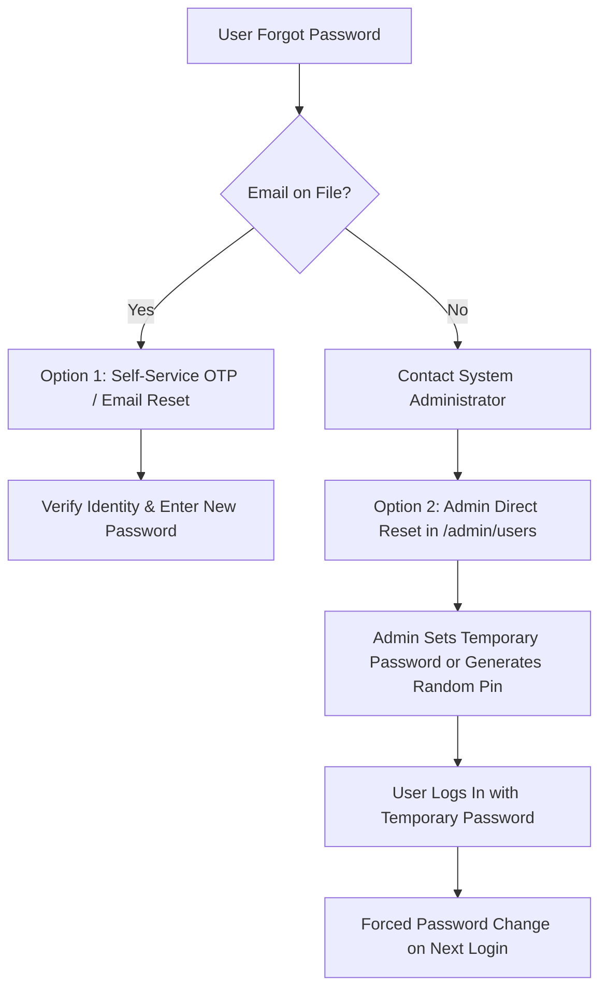

# Security Architecture, Vulnerability Audit & Hardening Roadmap

**Project:** Tax Summary Employee Application (سامانه جامع اداری و پرسنلی اداره کل امور مالیاتی)  
**Date:** September 2026  
**Status:** Audit & Action Plan  
**Target Environment:** Iranian Tax Administration Intranet / Private Enterprise Network  

---

## 1. Executive Summary & Threat Model

The Tax Summary Employee Application manages sensitive financial records, employee personnel data, tax refund dossiers (under Articles 242 & 243 of the Direct Taxes Act), and administrative evaluations. 

Given the sensitivity of payroll, tax evasion detection figures, and personnel evaluations, the application must adhere to strict principles of:
- **Confidentiality:** Unauthorized personnel must not view or exfiltrate another employee's financial or disciplinary records.
- **Integrity:** Tax computations, payroll data, and employee ratings must only be modifiable by authorized managers or administrators with an immutable audit trail.
- **Availability:** Core administrative endpoints must resist brute-force attacks and Denial of Service (DoS).

---

## 2. Password Reset Mechanisms: Current State & Implementation Plan

### 2.1 Current State in Codebase
Currently, password alteration is limited to:
- **Endpoint:** `POST /api/auth/change-password`
- **Controller:** [`AuthController.cs`](file:///E:/projects/tax_summary_employee_app/Backend/TaxSummary.Api/Controllers/AuthController.cs#L143-L173)
- **Requirement:** User must be logged in and must supply `CurrentPassword` and `NewPassword`.
- **Limitation:** If a user **forgets** their password, there is **no recovery path**. Neither a self-service reset nor an administrative reset is exposed. Furthermore, because email is optional (and frequently omitted for intranet users such as `kamrava`), standard "email reset link" flows cannot be the primary reset mechanism.

### 2.2 Recommended Password Reset Architecture

For an enterprise intranet application with optional email addresses, the industry standard is a **two-tier reset architecture**:

#### Option A: Admin-Initiated Reset (Essential for Enterprise / Intranet)
1. **API Endpoint:** `POST /api/users/{id}/reset-password` (Restricted to `[Authorize(Roles = "Admin")]`).
2. **Payload:** `{ newPassword: string, forceChangeOnNextLogin: boolean }`
3. **Execution:**
   - Verify user exists.
   - Hash `newPassword` using `IPasswordHasher` (BCrypt work factor 12).
   - Call `user.UpdatePassword(hash)`.
   - Call `user.UnlockAccount()` (resets failed attempt counter and clears lock).
   - Revoke all active refresh tokens (`_userRepository.RevokeAllUserTokensAsync(id)`).
   - If `forceChangeOnNextLogin` is true, set a flag `MustChangePassword = true`.
4. **Admin UI:** Add a "بازنشانی رمز" (Reset Password) button and modal dialog on the `/admin/users` management table.

#### Option B: User Self-Service Reset (When Email Exists)
1. **Endpoint:** `POST /api/auth/forgot-password` (Accepts username or email).
2. If the user has a verified email on file, generate a cryptographically secure, time-limited (15 minutes), single-use token or 6-digit numeric OTP.
3. User submits token to `POST /api/auth/reset-password`.

---

## 3. Comprehensive Vulnerability Audit

### 🔴 Critical & High Severity Findings

| # | Vulnerability | Location | Risk / Impact |
|---|---------------|----------|---------------|
| **V-01** | **Unauthenticated Seed Endpoint** | [`SeedController.cs`](file:///E:/projects/tax_summary_employee_app/Backend/TaxSummary.Api/Controllers/SeedController.cs#L22) | **Critical:** `POST /api/seed/upload` lacks `[Authorize]`. Any unauthenticated user on the network can upload an Excel file and wipe/overwrite database records. |
| **V-02** | **Overly Permissive CORS with Credentials** | [`Program.cs`](file:///E:/projects/tax_summary_employee_app/Backend/TaxSummary.Api/Program.cs#L87-L96) | **High:** `policy.SetIsOriginAllowed(origin => true).AllowCredentials()` allows any website to make authenticated cross-origin requests to the API, bypassing the Same-Origin Policy (CSRF). |
| **V-03** | **Broken Object-Level Authorization (BOLA / IDOR)** | [`EmployeeReportsController.cs`](file:///E:/projects/tax_summary_employee_app/Backend/TaxSummary.Api/Controllers/EmployeeReportsController.cs#L95-L186) | **High:** `CreateReport`, `UpdateReport`, `DeleteReport`, and `GetReport` have no role constraints. Any logged-in `Employee` can modify or view confidential financial evaluations of any other employee. |
| **V-04** | **Hardcoded JWT Secret Key** | [`appsettings.json`](file:///E:/projects/tax_summary_employee_app/Backend/TaxSummary.Api/appsettings.json#L7) | **High:** The HMAC-SHA256 secret key is stored in plain text in source control. Anyone with repo access can forge administrative JWT tokens. |

---

### 🟡 Medium Severity Findings

| # | Vulnerability | Location | Risk / Impact |
|---|---------------|----------|---------------|
| **V-05** | **Token Storage in `localStorage` (XSS Exposure)** | [`AuthContext.tsx`](file:///E:/projects/tax_summary_employee_app/frontend/contexts/AuthContext.tsx#L21) | **Medium:** Storing JWT access tokens in browser `localStorage` exposes them to theft via Cross-Site Scripting (XSS). |
| **V-06** | **Refresh Token Cookie Misconfiguration** | [`AuthController.cs`](file:///E:/projects/tax_summary_employee_app/Backend/TaxSummary.Api/Controllers/AuthController.cs#L51) | **Medium:** `SetRefreshTokenCookie(result.Value!.AccessToken)` stores the short-lived *Access Token* in the cookie instead of the actual refresh token. |
| **V-07** | **Plaintext Refresh Tokens in Database** | [`AuthService.cs`](file:///E:/projects/tax_summary_employee_app/Backend/TaxSummary.Application/Services/AuthService.cs#L99) | **Medium:** Refresh tokens are saved in plaintext (`tokenHash: refreshTokenString`). A database leak compromises all active sessions. |
| **V-08** | **Lack of API Rate Limiting** | Entire API Pipeline | **Medium:** No IP-level rate limiting on `/api/auth/login`, `/api/auth/register`, or calculation engines. Allows credential stuffing and resource exhaustion. |
| **V-09** | **Known Vulnerability in Dependency** | `AutoMapper 13.0.1` | **Medium:** Flagged by [GHSA-rvv3-g6hj-g44x](https://github.com/advisories/GHSA-rvv3-g6hj-g44x) for potential type confusion / arbitrary member access. |
| **V-10** | **File Upload Magic Bytes Verification** | [`PhotoUploadValidator.cs`](file:///E:/projects/tax_summary_employee_app/Backend/TaxSummary.Application/Validators/PhotoUploadValidator.cs#L24-L32) | **Medium:** Validates only file extensions and MIME headers sent by the client, without inspecting binary file signatures (magic bytes). |

---

### 🟢 Low Severity & Best Practice Gaps

| # | Issue | Location | Impact |
|---|-------|----------|--------|
| **V-11** | **Missing HTTP Security Headers** | [`Program.cs`](file:///E:/projects/tax_summary_employee_app/Backend/TaxSummary.Api/Program.cs) | Missing `X-Content-Type-Options: nosniff`, `X-Frame-Options: DENY`, and Content Security Policy (CSP). |
| **V-12** | **No Audit Logging for Privileged Actions** | Data Modification Endpoints | No centralized audit trail recording who created/edited/deleted payroll or user accounts. |
| **V-13** | **No Manual Account Unlocking Mechanism** | [`UsersController.cs`](file:///E:/projects/tax_summary_employee_app/Backend/TaxSummary.Api/Controllers/UsersController.cs) | When an account is locked due to 5 failed attempts, administrators cannot manually unlock it before the timer expires. |

---

## 4. Step-by-Step Security Hardening Roadmap

### Phase 1: Urgent Remediations (Immediate Action) - COMPLETED
- [x] **1.1 Restrict `SeedController` Access:**
  - Added `[Authorize(Roles = "Admin")]` to `SeedController.cs`.
- [x] **1.2 Fix CORS Configuration:**
  - Replaced wildcard origin reflection with strictly configured origins from `appsettings.json` in `Program.cs`.
- [x] **1.3 Add Role Authorization on Employee Reports:**
  - Protected `CreateReport`, `UpdateReport`, `DeleteReport`, and `UploadPhoto` with `[Authorize(Roles = "Admin,Manager")]`.
  - Added ownership verification on `GetReport` and `GetReportByPersonnelNumber` so standard `Employee` accounts can only access their own linked dossier.
- [x] **1.4 Implement Admin Password Reset & Account Unlock:**
  - Added `ResetPasswordAsync` and `UnlockUserAsync` to `IUserService` and `UserService`.
  - Added `POST /api/users/{id}/reset-password` and `POST /api/users/{id}/unlock` in `UsersController.cs`.
  - Created interactive Persian Reset Password modal and account lockout indicators/actions in `frontend/app/admin/users/page.tsx`.
  - Fixed `null` email claim crash in `JwtTokenService.cs`.

---

### Phase 2: Authentication & Token Architecture Hardening - COMPLETED
- [x] **2.1 Hash Refresh Tokens at Rest:**
  - Refresh tokens are hashed using SHA-256 (`_jwtTokenService.HashRefreshToken`) before saving to `RefreshTokens.TokenHash`.
  - On `/refresh` and `/logout`, incoming tokens are hashed with SHA-256 to query and revoke records.
- [x] **2.2 Fix Refresh Token Cookie Delivery:**
  - Resolved placeholder in `AuthController.cs`; now delivers actual raw refresh token string in HttpOnly cookie (`SameSite=Lax`, `Secure` when HTTPS) and excludes it from JSON body via `[JsonIgnore]`.
- [x] **2.3 Environment-Based Secret Management:**
  - Configured `JWT_SECRET_KEY` environment variable resolution in `Program.cs` and `JwtTokenService.cs`.
- [x] **2.4 Enforce Password Policies & Forced Change:**
  - Added `MustChangePassword` boolean column to `User` entity via EF migration `AddMustChangePasswordToUser`.
  - Admin password resets automatically activate `user.RequirePasswordChange()`.
  - Users with `mustChangePassword == true` are intercepted on login and redirected to `/change-password`.
  - Created dedicated Persian `/change-password` page with forced policy banner and password validation.
  - Resetting password via `POST /api/auth/change-password` clears `MustChangePassword` back to `false`.

---

### Phase 3: Anti-Abuse, Rate Limiting & Input Sanitization - COMPLETED
- [x] **3.1 Implement ASP.NET Core Rate Limiting:**
  - Configured `Microsoft.AspNetCore.RateLimiting` in `Program.cs`:
    - Strict sliding window limiter (`AuthPolicy`, 10 requests / min per IP) on `/api/auth/login` and `/api/auth/register`.
    - General fixed window limiter (`GeneralPolicy`, 100 requests / min per IP) on core controllers.
    - Custom `OnRejected` handler returning HTTP 429 Too Many Requests with Persian localized alert message.
- [x] **3.2 File Upload Binary Signature (Magic Bytes) Verification:**
  - In `PhotoUploadValidator.cs` and `LocalFileStorageService.cs`, inspect header bytes directly from the stream:
    - JPEG: `FF D8 FF`
    - PNG: `89 50 4E 47 0D 0A 1A 0A`
  - Rejects disguised script files with HTTP 400 and localized Persian error message.
- [x] **3.3 Formula Injection Defense for Excel:**
  - Created `FormulaInjectionSanitizer.cs` in `TaxSummary.Domain.Common` to defend against CSV/Excel Formula Injection (CWE-1236).
  - Escapes exported cells in `TaxRefundExcelService.cs` starting with dangerous characters (`=`, `+`, `-`, `@`, `\t`, `\r`) by prepending `'`.
  - Neutralizes imported formula headers in `ExcelSeedService.cs`.
  - Covered with unit tests in `FormulaInjectionSanitizerTests.cs`.
- [x] **3.4 Address AutoMapper Vulnerability:**
  - Mitigated GHSA-rvv3-g6hj-g44x (uncontrolled recursion / DoS) by enforcing `.MaxDepth(5)` across `MappingProfile.cs` and `TaxRefundMappingProfile.cs`.
  - Added `<NuGetAuditSuppress Include="https://github.com/advisories/GHSA-rvv3-g6hj-g44x" />` with documented mitigation rationale in `TaxSummary.Application.csproj`.

---

### Phase 4: Enterprise Audit Logging & Defense-in-Depth - COMPLETED
- [x] **4.1 Centralized Audit Log Entity, Interceptor & Admin UI:**
  - Created `AuditLog` entity in Domain (`UserId`, `Action`, `EntityName`, `EntityId`, `OldValues`, `NewValues`, `IpAddress`, `UserAgent`, `Timestamp`).
  - Implemented EF Core `AuditLogInterceptor` (`SaveChangesInterceptor`) to automatically record Created, Modified, and Deleted operations on domain entities within the same database transaction.
  - Automatically redacts sensitive fields (`PasswordHash`, `TokenHash`, `SecretKey`) with `[REDACTED]`.
  - Added `AuditLogs` table via EF Core migration `AddAuditLogsTable` and configured query indexes.
  - Added `AuditLogsController.cs` (`GET /api/audit-logs`, `GET /api/audit-logs/{id}`) restricted to `[Authorize(Roles = "Admin")]`.
  - Created dedicated administrative Audit Logs UI in `frontend/app/admin/audit-logs/page.tsx` with Persian filtering, pagination, stats, and a side-by-side value diff modal with redaction highlighting.
  - Registered menu setting `action_admin_audit_logs` in `DefaultMenuSettings.cs` and `Navbar.tsx`.
  - Covered with automated tests in `AuditLogInterceptorTests.cs`.
- [x] **4.2 Security Headers Middleware:**
  - Implemented `SecurityHeadersMiddleware.cs` in `TaxSummary.Api.Middleware` and hooked into `Program.cs` via `app.UseSecurityHeaders()`.
  - Configured response headers on all endpoints:
    - `X-Content-Type-Options: nosniff`
    - `X-Frame-Options: SAMEORIGIN`
    - `Referrer-Policy: strict-origin-when-cross-origin`
    - `Permissions-Policy: geolocation=(), camera=(), microphone=()`
    - `X-XSS-Protection: 1; mode=block`
    - `Content-Security-Policy`: restrictive CSP for scripts, styles, frames, and API endpoints.
- [x] **4.3 Secure In-Memory Session Storage & Silent Refresh:**
  - Implemented `tokenManager.ts` to keep the JWT access token in JavaScript runtime memory (module scope), completely eliminating persistent plaintext access token storage in `localStorage`.
  - Automated silent refresh on page load / reload via HttpOnly refresh cookie rotation without interrupting active sessions.
  - Mitigated persistent XSS token theft while preserving server-side middleware route authentication.

---

## 5. Verification Checklist

To confirm security hardening, verify each of the following:
1. **Unauthenticated Seed Test:** `curl -X POST http://localhost:5000/api/seed/upload` returns `401 Unauthorized`.
2. **CORS Origin Test:** Making a fetch request from an unauthorized origin returns CORS blocked error.
3. **BOLA Test:** Logging in as an `Employee` and attempting to `DELETE /api/employeereports/{id}` returns `403 Forbidden`.
4. **Admin Reset Test:** Admin successfully resets a user's password from the UI, user successfully logs in with the new password, and previous sessions are revoked.
5. **Lockout & Unlock Test:** Entering 5 wrong passwords locks the account; Admin triggers unlock; user can immediately log in.
